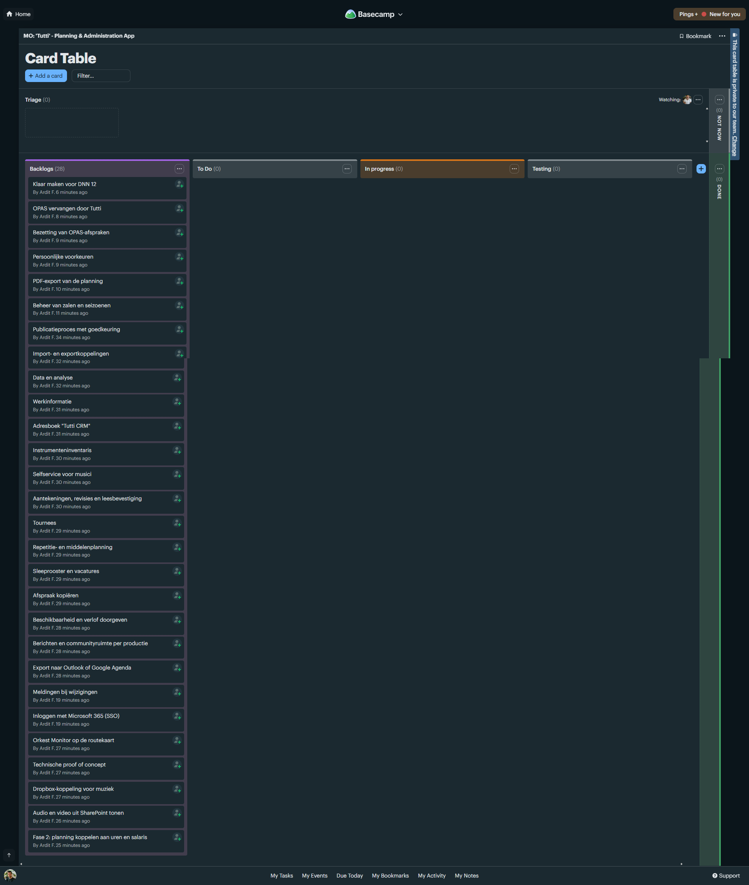
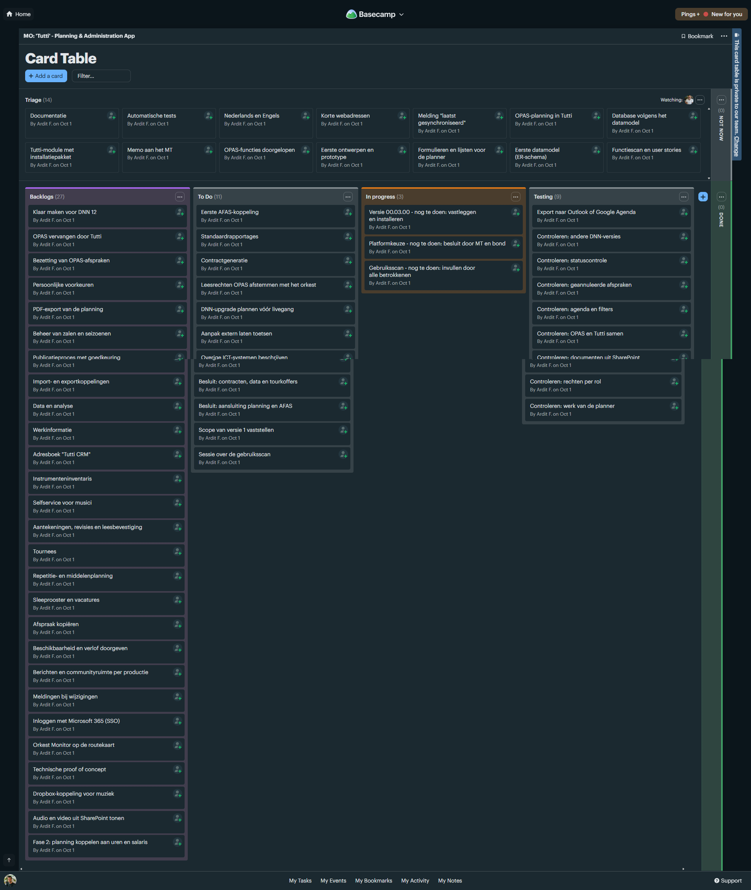

# Logboek

- **Totaal gewerkte uren:** 88
- **Aantal werkdagen:** 11

De kolom **Bewijs** verwijst per dag naar het resultaat van dat werk: een document in deze map, een schermafbeelding (zie [Bewijsmateriaal](#bewijsmateriaal)) of een commit in de repository van Tutti.

| Datum | Duur&nbsp;(uren) | Beschrijving | Bewijs |
|---|---|---|---|
| 16‑09‑2026 | 8 | Gewerkt aan het adviesrapport Eigen DNN-module of 2sxc, waarin ik de twee oplossingsrichtingen voor de doorontwikkeling van Tutti per criterium heb vergeleken. Dit advies vormt de basis voor de technische keuzes in de rest van het project. | [Eigen DNN-module of 2sxc](<../05. Advice/Eigen_DNN-module_of_2sxc.md>) |
| 17‑09‑2026 | 8 | Begonnen aan de Technische SRS van Tutti, waarin ik de systeemcontext, de architectuur en de onderdelen van de applicatie vastleg. Zo staat vast wat er gebouwd moet worden voordat ik aan de realisatie begin. | [Technische SRS - Tutti](<../02. Analysis/Technische_SRS_Tutti.md>) |
| 18‑09‑2026 | 8 | Diagrammen gemaakt van het datamodel van Tutti, zodat de tabellen en hun onderlinge relaties visueel te begrijpen zijn. Hiermee kunnen ook mensen zonder technische achtergrond zien hoe de gegevens samenhangen. | [Technische SRS - Tutti, 5.1 ERD](<../02. Analysis/Technische_SRS_Tutti.md#51-erd>) Commits [5f91c2d](https://github.com/Bond-for-web-solutions/Dnn.Modules.Tutti/commit/5f91c2df29539d652e85803803fff102615bfcab), [09358a4](https://github.com/Bond-for-web-solutions/Dnn.Modules.Tutti/commit/09358a44872362b8033c4fce0b7f38330494d1e3) |
| 23‑09‑2026 | 8 | Onderzocht waar de gegevens in DNN zijn opgeslagen en hoe ze worden opgehaald. Op basis daarvan heb ik een plan van aanpak gemaakt voor hoe Tutti deze gegevens gaat gebruiken. | [AANVULLEN: link of schermafbeelding van het onderzoek of het plan van aanpak] |
| 24‑09‑2026 | 8 | Getest of mijn plan van aanpak ook in de praktijk werkt door de gegevens in de echte DNN-omgeving op te halen. Zo kon ik vaststellen dat de aanpak bruikbaar is voordat ik erop verder bouwde. | [AANVULLEN: schermafbeelding van de opgehaalde gegevens in DNN] |
| 25‑09‑2026 | 8 | De feedback van mijn docent over de folderstructuur heb ik verwerkt in mijn documentatie. Daarnaast heb ik mijn document aangepast, zodat ik meer focus leg op het proces en minder op wat ik heb geleerd. | [AANVULLEN: feedback van de docent (bericht of schermafbeelding)] |
| 30‑09‑2026 | 8 | De Tutti app is verder ontwikkeld en uitgebreid met OPAS-data en documentintegratie via SharePoint. Daarnaast zijn de beveiliging, foutafhandeling en downloads verbeterd en is de app uitgebreid getest. | Commits [527f69a](https://github.com/Bond-for-web-solutions/Dnn.Modules.Tutti/commit/527f69a04bce8c610945a4f7a003eb7bf457bebe), [bd7b535](https://github.com/Bond-for-web-solutions/Dnn.Modules.Tutti/commit/bd7b5356d40da5c56b1d5b02201399ddb7a9dffb) |
| 01‑10‑2026 | 8 | Tutti uitgebreid, waarin afspraken en producties uit OPAS en Tutti op dezelfde pagina's staan met een label en filter per bron. Omdat Tutti en OPAS hun afspraken los van elkaar nummeren, heb ik korte adressen met een bronletter gemaakt en daar integratietests voor geschreven. Daarnaast heb ik een ontwerpdocument met vier diagrammen en een kanbanoverzicht van de stand van zaken gemaakt. | [Gegevensstromen - Tutti](<../03. Design/Gegevensstromen.md>) [Figuur 1](#figuur-1-backlog-in-basecamp) |
| 02‑10‑2026 | 8 | Een kanbanbord in Basecamp opgezet met de taken die ik de komende periode voor Tutti ga uitvoeren, verdeeld over de kolommen te doen, bezig en klaar. Zo is voor mij en het team in één overzicht te zien wat de planning is en wat de stand van zaken is. | [Figuur 2](#figuur-2-kanbanbord-in-basecamp) |
| 06‑10‑2026 | 8 | Tutti verder aangepast op basis van feedback: het scherm Beheer staat uit, "Mijn producties" heet nu "Producties" en de dagweergave markeert het huidige uur. Daarnaast heb ik een scherm Instellingen gebouwd waarin een beheerder de tijdzone, de themakleuren en de kleuren van de legenda kan aanpassen en terugzetten naar de standaard. Ook ben ik begonnen met het exporteren van afspraken naar de Outlook-agenda, zodat musici hun diensten in hun eigen agenda kunnen zien. | Commits [2d809db](https://github.com/Bond-for-web-solutions/Dnn.Modules.Tutti/commit/2d809db259e4998901eb484fbe4caa046c028320), [0dd69b8](https://github.com/Bond-for-web-solutions/Dnn.Modules.Tutti/commit/0dd69b800ba1338dbee0d7d6bf6c78493feacf7c) |
| 07‑10‑2026 | 8 | De export naar de Outlook-agenda afgemaakt: een gebruiker kan één afspraak of de afspraken die in de agenda zichtbaar zijn downloaden als .ics-bestand en dat in Outlook importeren. Ik heb gekozen voor dit standaardformaat, zodat het ook werkt in Google Agenda en Apple Agenda, en de export laat alleen de afspraken zien die de gebruiker in Tutti ook mag zien. Met tests en een controle met een losstaande iCalendar-lezer heb ik nagegaan dat het bestand correct is. | Commit [6db1bcf](https://github.com/Bond-for-web-solutions/Dnn.Modules.Tutti/commit/6db1bcf610c787ee502d70ea477ddcf3c5de4747) |

## Bewijsmateriaal

### Figuur 1. Backlog in Basecamp

*Figuur 1. Eerste versie van het kanbanbord (Card Table) in het Basecamp-project "MO: 'Tutti' - Planning & Administration App": alle 28 functionaliteiten staan nog in de backlog.*

### Figuur 2. Kanbanbord in Basecamp

*Figuur 2. Het kanbanbord nadat de taken zijn verdeeld over de kolommen Triage (14), Backlogs (27), To Do (11), In progress (3) en Testing (9).*
