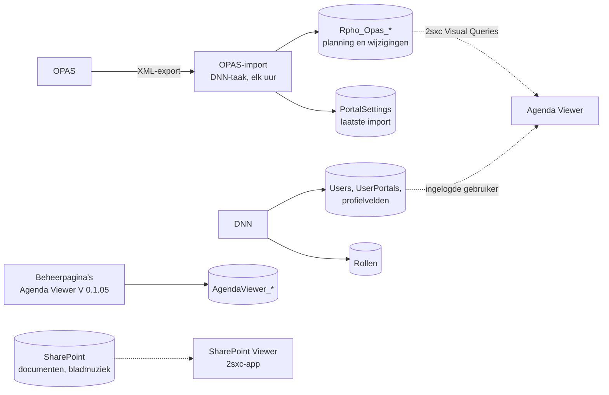

# Gegevens in DNN - onderzoek en plan van aanpak

*Analyse · Gegevensbronnen van Tutti · Metropole Orkest*

Dit document beschrijft waar de gegevens die Tutti nodig heeft in DNN (Metrostation) zijn opgeslagen, hoe ze nu worden opgehaald, en welk plan van aanpak daaruit volgt voor de manier waarop Tutti ze gaat gebruiken.

| Gegeven | Waarde |
| --- | --- |
| Documenttype | Analyse en plan van aanpak |
| Competentie | Analysis (ook Design: deelvraag 2 en 3) |
| Deelvraag | 2 - architectuur- en integratieaanpak; 3 - data- en autorisatiemodel |
| Auteur | Ardit Fazliji |
| Datum onderzoek | 23 september 2026 |
| Uitgewerkt | 8 oktober 2026 |
| Status | Concept |
| Gerelateerd | [Agenda Viewer (Metropole Orkest)](<Agenda_Viewer.md>) · [Technische SRS - Tutti](<Technische_SRS_Tutti.md>), hoofdstuk 8.4, 9 en 19 · [Eigen DNN-module of 2sxc](<../05. Advice/Eigen_DNN-module_of_2sxc.md>) · [Databaseontwerp - Tutti](<../03. Design/Databaseontwerp.md>) · [Gegevensstromen - Tutti](<../03. Design/Gegevensstromen.md>) |

## Inhoud

- [Samenvatting](#samenvatting)
1. [Inleiding](#1-inleiding)
2. [Methode](#2-methode)
3. [Resultaten: waar de gegevens staan en hoe ze worden opgehaald](#3-resultaten-waar-de-gegevens-staan-en-hoe-ze-worden-opgehaald)
4. [Plan van aanpak voor Tutti](#4-plan-van-aanpak-voor-tutti)
5. [Discussie en beperkingen](#5-discussie-en-beperkingen)
6. [Conclusie en vervolgstappen](#6-conclusie-en-vervolgstappen)

## Samenvatting

Alle gegevens die Tutti nodig heeft, staan al in de SQL Server-database van de DNN-site, maar ze hebben drie verschillende eigenaren. De OPAS-planning staat in de tabellen `dbo.Rpho_Opas_*`, die een aparte DNN-module (de OPAS-import) elk uur vult. Gebruikers, rollen en profielvelden zijn van DNN zelf. Documenten en bladmuziek staan niet in DNN maar in SharePoint en worden via de 2sxc-app SharePoint Viewer bereikbaar gemaakt. De Agenda Viewer leest de OPAS-tabellen via 2sxc Visual Queries; de eigen beheertabellen van de Agenda Viewer (`AgendaViewer_*`) worden door de agenda nooit gelezen.

Het plan van aanpak is: Tutti **leest** de gegevens van anderen rechtstreeks en kopieert niets, en **schrijft** alleen in eigen tabellen `Tutti_*`. De OPAS-planning wordt bij elke pagina gelezen via een eigen datalaag in de Tutti-module (niet via 2sxc), personen zijn DNN-gebruikers, rollen zijn DNN-rollen, en documenten lopen via de SharePoint Viewer als de bezoeker zelf. Dit wijkt af van de Technische SRS, die een import van OPAS in Tutti beschrijft; de reden staat in 4.2.

## 1. Inleiding

### 1.1 Aanleiding

Op 18 september 2026 heb ik in de [Technische SRS - Tutti](<Technische_SRS_Tutti.md>) het doelbeeld van Tutti vastgelegd, inclusief een datamodel. Voordat ik aan de realisatie begon, moest duidelijk zijn welke gegevens al in Metrostation beschikbaar zijn en hoe ze daar terechtkomen. Tutti draait als eigen DNN-module op dezelfde site als de Agenda Viewer (advies [Eigen DNN-module of 2sxc](<../05. Advice/Eigen_DNN-module_of_2sxc.md>)), dus het moet met dezelfde gegevens werken zonder de bestaande agenda te verstoren.

### 1.2 Onderzoeksvraag

**Waar zijn de gegevens die Tutti nodig heeft in DNN opgeslagen, hoe worden ze nu opgehaald, en hoe kan Tutti ze gebruiken zonder gegevens dubbel op te slaan of de bestaande koppelingen te breken?**

Deelvragen:

1. Welke gegevens heeft Tutti nodig: planning (producties en afspraken), wijzigingen, personen, rollen en documenten?
2. Waar staat elk van die gegevens en wie is de eigenaar?
3. Hoe haalt de Agenda Viewer ze nu op?
4. Welke manier van ophalen past bij Tutti?

Het onderzoek draagt bij aan deelvraag 2 (architectuur- en integratieaanpak) en deelvraag 3 (data- en autorisatiemodel) van het afstudeerproject.

### 1.3 Afbakening

Dit onderzoek gaat over gegevens die al in of via Metrostation beschikbaar zijn. AFAS en Microsoft 365 vallen erbuiten; die koppelingen staan in hoofdstuk 8 van de Technische SRS en zijn nog niet gebouwd. De OPAS-import zelf (hoe OPAS de export maakt en hoe de import die verwerkt) is van Bond en wordt niet aangepast.

## 2. Methode

| Methode | Bron | Waarom |
| --- | --- | --- |
| Documentanalyse | [Agenda Viewer (Metropole Orkest)](<Agenda_Viewer.md>), de documentatie en scriptie van Angelique Smit, het [Tutti & OPAS-dossier](<Tutti_OPAS_dossier.md>) | Laat zien hoe de bestaande agenda aan zijn gegevens komt en welke regels het MO al heeft goedgekeurd |
| Analyse van de broncode | De Agenda Viewer (V 0.1.05): 2sxc Visual Queries, `dataService.js`, de beheercontrollers | Bevestigt welke tabellen werkelijk worden gelezen en geschreven |
| Analyse van het databaseschema | De database van de ontwikkelomgeving van Metrostation: tabellen `Rpho_Opas_*`, DNN-tabellen voor gebruikers, rollen en profielvelden, `PortalSettings` | Laat zien wat er feitelijk staat, los van wat documentatie belooft |
| Vergelijking met het doelbeeld | Technische SRS hoofdstuk 5, 8.4, 9 en 19 | Laat zien waar de bestaande situatie afwijkt van wat de SRS aanneemt |

De Agenda Viewer, de OPAS-import en de SharePoint Viewer zijn niet door mij gemaakt. Mijn bijdrage is het onderzoek naar hoe ze samenhangen en het plan van aanpak in hoofdstuk 4.

## 3. Resultaten: waar de gegevens staan en hoe ze worden opgehaald

### 3.1 Overzicht

Het diagram laat per soort gegeven zien wie het schrijft (getrokken lijn) en wie het leest (gestippelde lijn), zoals het was vóór Tutti.

### 3.2 De OPAS-planning

- **Waar:** de tabellen `dbo.Rpho_Opas_*` in de database van de site. De belangrijkste zijn `Rpho_Opas_EventItem` (één rij per afspraak, met zaal, dirigent, ensemble, seizoen en project als kolommen) en `Rpho_Opas_Wijziging` (wat de import zag veranderen, als Nederlandse zin).
- **Wie schrijft:** de OPAS-import, een aparte DNN-module van Bond die ook bij andere orkesten draait (vandaar het voorvoegsel `Rpho_`). Een geplande taak leest elk uur de export van OPAS en werkt de tabellen bij. Het tijdstip van de laatste import staat in de portalinstelling `OpasLastXmlImportDate`.
- **Wat er niet in staat:** een productie heeft geen eigen tabel. Een productie is de groep afspraken met hetzelfde `EventProjectID`, en het productienummer is het begin van `EventProjectName` ("2637M1 Hiromi" → 2637M1). Wie bij een afspraak speelt, slaat de import niet op; alleen de dirigent staat erin. De tabellen voor programma en solisten (`Rpho_Opas_WorkItem`, `Rpho_Opas_WorkArtist`) bestaan, maar zijn leeg omdat de export van het orkest ze niet vult.
- **Geen foreign keys.** De relaties tussen de OPAS-tabellen zijn afspraken van de import, niet vastgelegd in de database.

> **FEIT**
>
> Gemeten in de ontwikkeldatabase op 30 september 2026: 1064 rijen in `Rpho_Opas_EventItem` (januari 2025 tot november 2027, 87 projecten) en 3599 rijen in `Rpho_Opas_Wijziging`. Vier rijen missen een titel of geldig tijdvak.

### 3.3 Hoe de Agenda Viewer de planning ophaalt

De Agenda Viewer leest de OPAS-tabellen met 2sxc Visual Queries: SQL-query's die in de 2sxc-app zijn gedefinieerd en die het JavaScript in de browser via de web-API van 2sxc aanroept. Het afspraaktype wordt afgeleid uit trefwoorden in `EventText` (een wens van het MO), en de kleur van vervoer en soundcheck volgt het hoofdevenement ernaast (de groeperingsregel). Zie [Agenda Viewer](<Agenda_Viewer.md>), 3.2 en 3.4.

De beheerpagina's die in V 0.1.05 zijn toegevoegd, schrijven in eigen tabellen `AgendaViewer_Production`, `AgendaViewer_Events`, `AgendaViewer_Venue` en `AgendaViewer_Changes`. **De agenda leest die tabellen niet**: alle pagina's voor musici lezen nog steeds `Rpho_Opas_EventItem`. Bovendien staan de schrijfadressen open voor anonieme gebruikers ([Agenda Viewer](<Agenda_Viewer.md>), 4.2).

### 3.4 Personen en rollen

- **Personen** zijn DNN-gebruikers (tabellen `Users` en `UserPortals`). Naam, e-mail en of het account actief is, komen uit DNN. Extra gegevens zoals hoofdinstrument kunnen als profielveld in het gewone gebruikersbeheer van DNN worden vastgelegd.
- **Rollen** zijn DNN-beveiligingsrollen. DNN regelt het inloggen; de Technische SRS gaat uit van Microsoft 365 / Entra ID met DNN als tussenpersoon (`AUTH-001`).
- De Technische SRS beschrijft een eigen tabel `Person` met een koppeling naar de DNN-gebruiker (`DnnUserId`). Iedereen die Tutti gebruikt, heeft echter al een DNN-account nodig om in te loggen.

### 3.5 Documenten en bladmuziek

Documenten staan niet in de database. De Agenda Viewer kent twee bronnen: ADAM, de bestandsopslag van 2sxc in DNN, waarbij de titel van een document wordt gematcht op het productienummer; en SharePoint via de aparte 2sxc-app SharePoint Viewer, die bepaalt welke mappen bij welk instrument horen. In de Agenda Viewer werkte de SharePoint-route nog niet (story V 0.1.06 #1 stond open).

### 3.6 Samenvatting van de bronnen

| Gegeven | Waar | Eigenaar | Huidige manier van ophalen |
| --- | --- | --- | --- |
| Planning (afspraken, producties) | `Rpho_Opas_EventItem` | OPAS-import | 2sxc Visual Queries in de Agenda Viewer |
| Wijzigingen | `Rpho_Opas_Wijziging` | OPAS-import | 2sxc Visual Query |
| Tijdstip laatste import | `PortalSettings` | OPAS-import | Door de OPAS-import zelf |
| Personen | DNN-gebruikers en profielvelden | DNN | De ingelogde gebruiker |
| Rollen | DNN-rollen | DNN | Door DNN zelf |
| Documenten, bladmuziek | SharePoint (of ADAM) | MO / SharePoint Viewer | SharePoint Viewer of ADAM |
| Beheergegevens Agenda Viewer | `AgendaViewer_*` | Agenda Viewer V 0.1.05 | Geschreven, nooit gelezen door de agenda |

## 4. Plan van aanpak voor Tutti

### 4.1 Uitgangspunt

**Tutti leest de gegevens van anderen en schrijft alleen in eigen tabellen.** De OPAS-planning, de DNN-gebruikers en de documenten hebben al een eigenaar; Tutti voegt daar geen tweede kopie aan toe. Wat in Tutti zelf wordt ingevoerd (producties, afspraken, bezetting, wijzigingshistorie en audittrail) komt in eigen tabellen `Tutti_*` in dezelfde database, aangemaakt door de installatiescripts van de module.

### 4.2 De OPAS-planning

Ik heb drie manieren overwogen.

| Optie | Voordelen | Nadelen | Oordeel |
| --- | --- | --- | --- |
| A. OPAS importeren in de eigen tabellen van Tutti (zoals Technische SRS 8.4 en 19.1 fase 1 beschrijven) | Eén model voor alle planning; bezetting en status kunnen worden toegevoegd | Een tweede kopie die bij elke import moet worden bijgewerkt; twee importtaken op dezelfde bron; fouten in de synchronisatie | Niet nu |
| B. Dezelfde 2sxc Visual Queries gebruiken als de Agenda Viewer | Bestaat al; dezelfde uitkomst als de agenda | Domeinlogica en rechten komen in 2sxc, wat het advies [Eigen DNN-module of 2sxc](<../05. Advice/Eigen_DNN-module_of_2sxc.md>) juist afraadt; niet te testen zonder site | Afgewezen |
| C. De OPAS-tabellen rechtstreeks lezen vanuit een eigen datalaag van Tutti | Geen dubbele gegevens, niets om bij te houden; OPAS blijft leidend; rechten en regels op één plek in Tutti; te testen tegen een testdatabase | Tutti hangt af van het schema van de import; een OPAS-productie en een Tutti-productie met hetzelfde nummer staan als twee producties tot de latere overgang | **Gekozen** |

**Keuze en onderbouwing.** Zolang OPAS leidend is (fase 1 van de migratie), voegt een kopie alleen werk en foutkansen toe: de import van Bond houdt de tabellen al elk uur bij. Rechtstreeks lezen met geparametriseerde `SELECT`-opdrachten (`SEC-005`) vanuit een eigen datalaag houdt de regels en de rechten in de Tutti-module, zoals het advies vraagt. Het nadeel, dubbele producties tot de overgang, is aanvaardbaar omdat het samenvoegen toch bij fase 2 en 3 van de migratie hoort.

**Regels die Tutti overneemt van de Agenda Viewer**, zodat beide applicaties dezelfde planning tonen:

1. het productienummer is het begin van de projectnaam;
2. het afspraaktype komt uit `EventText`, niet uit het OPAS-type;
3. vervoer en soundcheck krijgen de kleur van het hoofdevenement ernaast (groeperingsregel);
4. rijen zonder titel of geldig tijdvak worden overgeslagen (`TR-DB-006`);
5. OPAS-tijden zijn Amsterdamse tijd en worden naar UTC omgezet (`TR-DB-010`);
6. een geannuleerde afspraak blijft zichtbaar en wordt gemarkeerd.

**Robuustheid.** Zijn de OPAS-tabellen niet te lezen, dan toont Tutti de eigen planning met een melding welk deel ontbreekt (`INT-002`). Is de laatste import langer dan 48 uur geleden, dan toont Tutti een waarschuwing (`INT-004`, `AVL-008`); daarvoor wordt de portalinstelling van de import gelezen.

### 4.3 Personen en rollen

Een persoon in Tutti **is** de DNN-gebruiker; er komt geen eigen personentabel. Hoofdinstrument en dienstverband worden profielvelden in DNN. Een tweede record van dezelfde persoon zou alleen een koppeling toevoegen die fout kan zijn of kan ontbreken. Rollen worden DNN-rollen in een eigen rolgroep voor Tutti, zodat het beheer van leden in het bekende gebruikersbeheer van DNN blijft. De rechten zelf (wie wat mag zien en wijzigen) beslist Tutti, op één plek in de servicelaag.

### 4.4 Documenten en bladmuziek

Tutti slaat geen documenten op. Tutti vraagt de SharePoint Viewer om de documenten van een productie, op productienummer, en doet dat namens de bezoeker zelf. De viewer weet al welke mappen bij welk instrument horen, dus Tutti krijgt nooit meer rechten dan de bezoeker. Tutti heeft daardoor geen eigen SharePoint-account of wachtwoorden nodig.

### 4.5 De tabellen van de Agenda Viewer

Tutti gebruikt de tabellen `AgendaViewer_*` niet. Ze worden door de agenda niet gelezen, hangen niet aan de OPAS-gegevens en zijn geschreven via onbeveiligde adressen. De eigen tabellen van Tutti vervangen ze.

### 4.6 Overzicht van het plan

| Gegeven | Bron | Tutti doet |
| --- | --- | --- |
| OPAS-planning en wijzigingen | `Rpho_Opas_*` | Lezen bij elke pagina, niets kopiëren of wijzigen |
| Tijdstip laatste import | `PortalSettings` | Lezen, waarschuwen na 48 uur |
| Eigen planning, bezetting, historie, audittrail | `Tutti_*` | Lezen en schrijven |
| Personen | DNN-gebruikers en profielvelden | Lezen |
| Rollen | DNN-rollen in de rolgroep van Tutti | Lezen; leden beheren in DNN |
| Documenten en bladmuziek | SharePoint via de SharePoint Viewer | Opvragen als de bezoeker, niets opslaan |
| Beheergegevens Agenda Viewer | `AgendaViewer_*` | Niet gebruiken |

## 5. Discussie en beperkingen

> **NUANCE**
>
> Het plan wijkt af van de Technische SRS op twee punten: OPAS wordt gelezen in plaats van geïmporteerd (SRS 8.4, 19.1), en er is geen tabel `Person` (SRS 5 en 9.1). Beide afwijkingen zijn na de realisatie vastgelegd met hun reden in het [Architectuurontwerp](<../03. Design/Architectuurontwerp.md>), hoofdstuk 12, en het [Databaseontwerp](<../03. Design/Databaseontwerp.md>), hoofdstuk 7. De SRS zelf is nog niet bijgewerkt.

- **Geen bezetting bij OPAS-afspraken.** De import slaat niet op wie bij een afspraak speelt. Tutti kan daarom voor OPAS-afspraken geen bezetting tonen en de OPAS-planning niet beperken tot de eigen producties van een musicus. Dit oplossen is een aanpassing van de OPAS-import, niet van Tutti.
- **Afhankelijk van het schema van de import.** Wijzigt Bond de `Rpho_Opas_*`-tabellen, dan moet de datalaag van Tutti mee. Er zijn geen foreign keys die zo'n wijziging zichtbaar maken.
- **Wat ik niet kon verifiëren.** De werking van de OPAS-import zelf heb ik afgeleid uit de tabellen en de documentatie, niet uit de broncode van de import.
- **Akkoord op het plan.** [AANVULLEN: met wie het plan van aanpak is besproken (bijvoorbeeld Marnix Bouwman) en wanneer]

## 6. Conclusie en vervolgstappen

De gegevens die Tutti nodig heeft, zijn er al, verdeeld over de OPAS-import, DNN en SharePoint. Het plan van aanpak laat elke eigenaar eigenaar: Tutti leest de OPAS-planning rechtstreeks, gebruikt de DNN-gebruikers en -rollen, vraagt documenten op via de SharePoint Viewer en schrijft alleen in eigen tabellen.

Vervolgstappen, zoals uitgevoerd:

1. **24 september 2026:** het plan getest door de gegevens in de echte DNN-omgeving op te halen (zie het [logboek](<../01. Professional Skills & Manage and Control/logboek.md>)).
2. **30 september 2026:** het plan gebouwd in Tutti 00.02.00: de OPAS-planning en de SharePoint-documenten in Tutti, met tests van elke SQL-opdracht tegen een testdatabase (commit [527f69a](https://github.com/Bond-for-web-solutions/Dnn.Modules.Tutti/commit/527f69a04bce8c610945a4f7a003eb7bf457bebe)).
3. **1 oktober 2026:** de uitkomst vastgelegd in het [Databaseontwerp](<../03. Design/Databaseontwerp.md>) en de [Gegevensstromen](<../03. Design/Gegevensstromen.md>).

Nog open: de Technische SRS bijwerken op de twee afwijkingen uit hoofdstuk 5, en met Bond bespreken of de OPAS-import de bezetting kan gaan opslaan.
