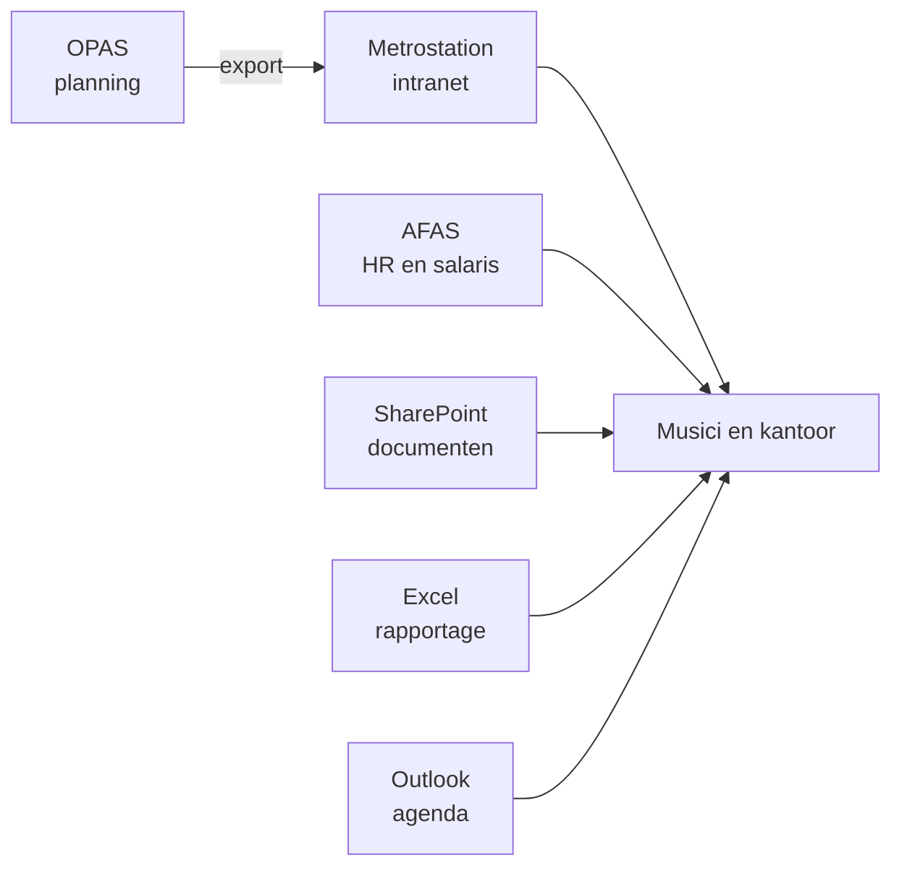
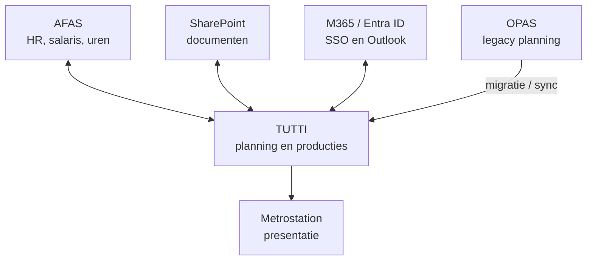
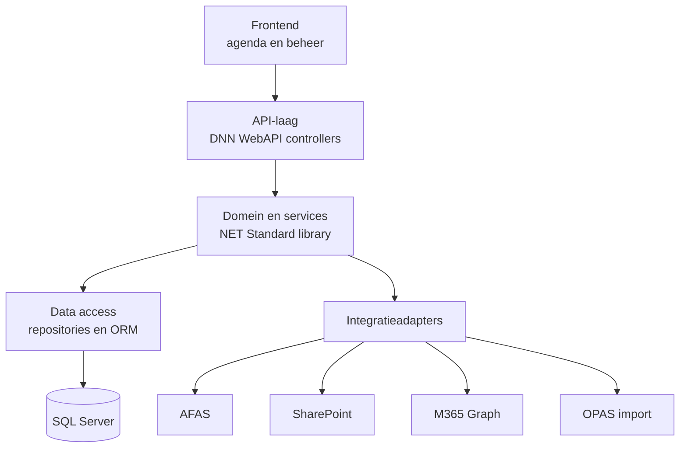
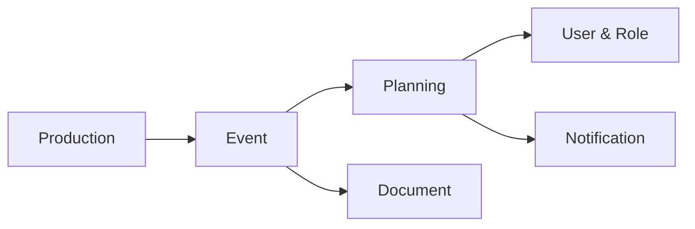
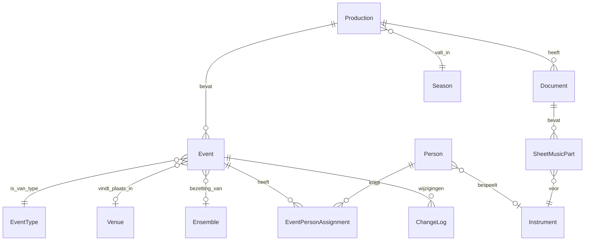
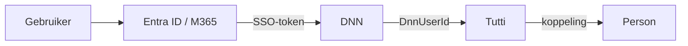
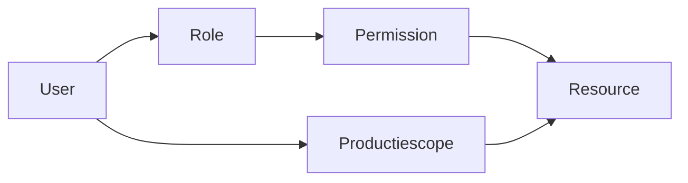
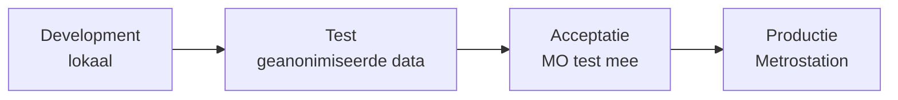
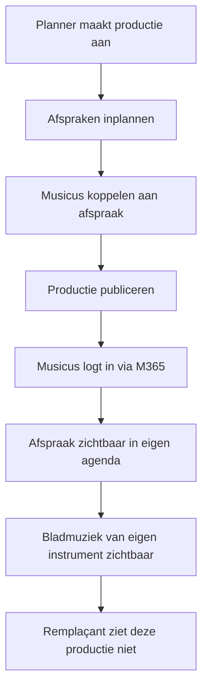
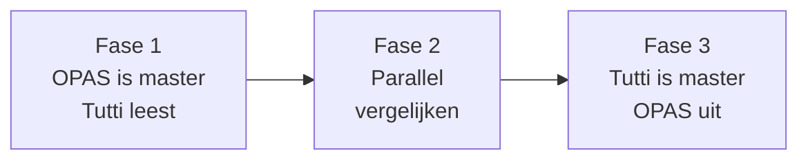

# Technische SRS - Tutti

Planning & Administration App · Metropole Orkest

Sep 18, 2026 · @Albadit

## Documentinformatie

Dit is de technische SRS van Tutti; de functionele eisen staan in de user stories en het programma van eisen.

| Veld | Waarde |
| --- | --- |
| Document | Technical Software Requirements Specification |
| Systeem | Tutti - Planning & Administration App |
| Opdrachtgever | Metropole Orkest |
| Realisatie | bond for web solutions |
| Versie | 0.1 - concept ter review |
| Doelgroep | Ontwikkelaars, architect, functioneel beheer, opdrachtgever |

**Leeswijzer.** De functionele SRS beschrijft wat een gebruiker wil: *als planner wil ik een muzikant aan een evenement kunnen koppelen*. Dit document beschrijft hoe dat technisch wordt gerealiseerd: een `EventPersonAssignment` koppelt een `Person` aan een `Event`, ontsloten via een beveiligd endpoint dat de permission `Event.Assignment.Manage` vereist.

Eisen zijn genummerd per categorie (`TR-DB`, `API`, `INT`, `AUTH`, `SEC`, `LOG`, `ERR`, `PERF`, `AVL`, `FE`, `ACC`, `DEP`, `TST`, `MIG`) zodat er in hoofdstuk 22 naar verwezen kan worden. Open punten staan als `TD-xxx` in hoofdstuk 21 en zijn bewust niet dichtgetimmerd.

## 1. Inleiding

### 1.1 Doel van het document

Dit document beschrijft de technische eisen, architectuur, integraties, beveiliging, datamodellen en randvoorwaarden voor de ontwikkeling van Tutti. Het dient als basis voor de bouw, voor de review door de architect en voor de acceptatie door het Metropole Orkest.

### 1.2 Doel van Tutti

Tutti wordt de centrale planning- en administratieapplicatie van het Metropole Orkest. Het systeem centraliseert de informatie rond producties en vervangt op termijn onderdelen van OPAS en van de losse processen in Excel en SharePoint.

Het leidende principe: **de planning wordt leidend voor de operatie, AFAS blijft leidend voor HR en verloning.** Koppelingen met Outlook, SharePoint en AFAS zijn ondersteunend en niet leidend voor de planning.

### 1.3 Scope

| In scope (v1) | Out of scope | Later |
| --- | --- | --- |
| Productiebeheer | Volledig HR-systeem | Contractgeneratie |
| Evenementen en agenda | Salarisverwerking | Tourmanagement en tourkoffers |
| Planning en personeelstoewijzing | Volledig muziekbeheersysteem | Instrumenteninventaris |
| Gebruikers, rollen en rechten | Financiële administratie | Enquêtemodule |
| API-laag | Publieke website | Mobiele app |
| Integraties (OPAS, SharePoint, M365) |  | AFAS-koppeling verdiepen |
| Logging en auditing |  | Urenregistratie |
| Beheeromgeving |  |  |

De definitieve scope van versie 1 is nog niet vastgesteld; zie `TD-006`. Bovenstaande indeling is het voorstel vanuit dit document.

### 1.4 Definities

| Term | Betekenis |
| --- | --- |
| Tutti | De te bouwen planning- en administratieapplicatie |
| Metrostation | Het bestaande DNN-intranet van het Metropole Orkest |
| OPAS | Huidig orkestplanningssysteem, bron van productienummers en diensten |
| Productie | Een project met een productienummer, bijvoorbeeld 2637M1 |
| Afspraak / Event | Concert, repetitie, soundcheck, vervoer, opname of educatie |
| Bezetting | De koppeling van een musicus aan een afspraak, met rol en aanwezigheid |
| Dienst | Een ingeplande afspraak vanuit het perspectief van de musicus |
| Remplaçant | Externe musicus, ingehuurd voor één of enkele producties |
| RBAC | Role Based Access Control |
| SSO | Single Sign-On via Microsoft 365 / Entra ID |

### 1.5 Referenties

- User stories musicus en planner, Basecamp, 12 mei 2025
- Releasehistorie agendamodule V 0.1 t/m V 0.1.06, Basecamp
- ER-schema en `datamodel_opas_minimaal.docx`, Basecamp, 12 mei 2025
- Memo *Verkenning nieuwe planning- en administratie app*, 28 mei 2026
- OPAS Gebruiksscan + Ontwikkelroute Nieuwe Planning App, 28 mei 2026
- Adviesrapport *Eigen DNN-module of 2sxc*, 14 september 2026

## 2. Systeemcontext

### 2.1 Huidige situatie

De informatie staat nu verspreid over vijf systemen, zonder één plek waar de waarheid ligt. OPAS levert de planning, Metrostation toont die, en de rest gebeurt handmatig in Excel en SharePoint.



Gevolgen: dubbel werk, dubbele licentiekosten, kans op fouten, afhankelijkheid van personen in plaats van systeem, en weinig eenduidig inzicht.

### 2.2 Gewenste situatie

Tutti wordt de centrale planning; de omliggende systemen worden koppelingen in plaats van eilanden.



### 2.3 Externe systemen en data-eigenaarschap

Per gegeven is er één master. Waar Tutti geen master is, houdt Tutti alleen een referentie of een gekopieerd kenmerk bij.

| Systeem | Master van | Tutti gebruikt | Richting |
| --- | --- | --- | --- |
| Tutti | Producties, afspraken, bezetting, publicatiestatus | - | - |
| AFAS | Personeelsgegevens, dienstverband, salaris, urenverantwoording | PersonId, naam, instrument, dienstverbandstatus | AFAS → Tutti (lezen), Tutti → AFAS (uren) |
| SharePoint | Documenten en bladmuziekbestanden | Verwijzing, metadata, versie | Tutti → SharePoint (lezen, uploaden) |
| M365 / Entra ID | Accounts, authenticatie | Identiteit, groepslidmaatschap | M365 → Tutti |
| Outlook | Persoonlijke agenda van de gebruiker | - | Tutti → Outlook (export) |
| Metrostation | Redactionele content | Presentatielaag voor Tutti | Tutti → Metrostation |
| OPAS | Planning, tot de omschakeling | Productienummer, afspraken, tijden, locatie, dirigent | OPAS → Tutti |

Na de omschakeling vervalt de rij OPAS en wordt Tutti master van de planning. Zie hoofdstuk 19.

## 3. Technische architectuur

### 3.1 Architectuuroverzicht

Tutti wordt een gelaagde applicatie waarin de domeinlogica losstaat van DNN. De frontend praat uitsluitend via de API; er is geen tweede weg naar de database.



De API-laag doet geen bedrijfslogica en geen autorisatiebeslissingen; die staan in de servicelaag. De integratieadapters zitten achter interfaces, zodat een externe koppeling vervangen kan worden zonder de domeinlogica te raken.

### 3.2 Technology stack

| Onderdeel | Technologie | Functie |
| --- | --- | --- |
| Applicatieplatform | DNN 9.x | Hosting, portals, gebruikersbeheer |
| Webserver | IIS op Windows Server | Hosting |
| Runtime | .NET Framework 4.8 | Uitvoering |
| Domeinlaag | .NET Standard 2.0 class library, C# | Bedrijfslogica, DNN-onafhankelijk |
| Database | SQL Server | Centrale dataopslag |
| Data access | ORM met migrations | Schema en queries |
| API | DNN WebAPI, REST/JSON | Ontsluiting |
| Frontend | Nader te bepalen, zie `TD-007` | UI |
| Authenticatie | Microsoft 365 / Entra ID via DNN | Login en SSO |
| Documenten | SharePoint, ADAM | Bestandsopslag |
| Versiebeheer en CI/CD | Git + pipeline | Build en release |

### 3.3 Architectuurprincipes

1. **Domeinlogica staat los van DNN.** De servicelaag is een .NET Standard-library zonder DNN-referenties; de DNN-module bevat alleen hosting, authenticatie-integratie en controllers.
2. **De API is de enige ingang.** Elke frontend - Metrostation, mobiel, beheerdashboard - gebruikt dezelfde endpoints.
3. **Autorisatie in de servicelaag, deny by default.** Geen enkele controller beslist zelf of iets mag.
4. **De database bewaakt integriteit.** Foreign keys, unique constraints en checks, niet alleen applicatiecode.
5. **Schema en gedrag staan in de repository.** Geen gedrag dat alleen via configuratie op productie bestaat.
6. **Externe systemen zijn adapters.** Geen externe SDK-types in het domein.

### 3.4 Architectuurbeslissing: eigen DNN-module

In de eerste verkenning zijn Plant-an-App en 2sxc als bouwoptie onderzocht; de agendamodule V 0.1 t/m V 0.1.06 is met 2sxc gebouwd. Op basis van het adviesrapport van 14 september 2026 is besloten het domein in een **eigen DNN-module** te bouwen.

|  | Besluit |
| --- | --- |
| Domein (producties, afspraken, bezetting, rechten, bladmuziek) | Eigen DNN-module met eigen SQL Server-schema |
| Redactionele content (nieuws, praktische info, uitgelicht) | Blijft in 2sxc op Metrostation |
| Scheidslijn | Alles wat aan een productienummer hangt en een rechtenvraag oproept, hoort in de module |

De belangrijkste redenen: één plek per bedrijfsregel, een relationeel schema met constraints, testbare autorisatie, en domeinlogica in gewone .NET die niet aan 2sxc gebonden is. De belangrijkste prijs: hogere bouwtijd vooraf en eigen verantwoordelijkheid voor security en migraties. Zie hoofdstuk 20.

## 4. Systeemcomponenten

Tutti bestaat uit zes modules met elk een eigen servicelaag en eigen endpoints. De Planning-module is de enige die over meerdere entiteiten heen beslist.



### 4.1 Production Module

Beheert producties als hoogste niveau. Verantwoordelijk voor: aanmaken en wijzigen van een productie, uniek productienummer, titel, start- en einddatum, status, productieleden en de koppeling naar evenementen en documenten. Een productie kan niet verwijderd worden zolang er afspraken aan hangen.

### 4.2 Event Module

Beheert afspraken binnen een productie. De ondersteunde types komen uit de bestaande agendamodule: **concert, repetitie, soundcheck, vervoer, opname en educatie**. De module bepaalt ook de afgeleide weergavekenmerken: de afkorting per type en de groeperingskleur (een soundcheck of vervoersafspraak direct voor of na een concert, repetitie of opname erft de kleur daarvan).

Die kleurregel is domeinlogica en staat in de service, niet in de frontend, zodat een mobiele client dezelfde uitkomst krijgt.

### 4.3 Planning Module

Beheert de kalender en de personeelstoewijzing. Verantwoordelijk voor: dag-, week-, maand- en lijstweergave, toewijzen van musici aan afspraken, aanwezigheidsstatus, openstaande posities, conflictdetectie en resourcetoewijzing.

Conflictdetectie kent minimaal twee regels: dezelfde persoon op twee overlappende afspraken, en dezelfde locatie op twee overlappende afspraken. Een conflict blokkeert niet, maar wordt gemarkeerd.

### 4.4 User & Role Module

Beheert identiteit en toegang. Verantwoordelijk voor: het koppelen van een DNN/M365-account aan een `Person`, rollen, permissies, en de toegang per productie - relevant voor remplaçanten, die maar bij één of enkele producties horen.

Deze module levert de centrale `ZichtbaarheidService` waar alle andere modules hun autorisatievraag stellen.

### 4.5 Document Module

Beheert documenten en bladmuziek bij een productie. Verantwoordelijk voor: de SharePoint-koppeling, metadata en versie, toegangsrechten, en het filteren van bladmuziek op het instrument van de ingelogde musicus.

Bestanden worden niet in de Tutti-database opgeslagen; alleen de verwijzing, de metadata en de rechten.

### 4.6 Notification Module

Verstuurt meldingen bij relevante wijzigingen. Verantwoordelijk voor: e-mail bij planningswijzigingen, de wijzigingshistorie die op detail- en productiepagina getoond wordt, agenda-export naar Outlook, en - later - pushnotificaties.

Meldingen worden asynchroon verstuurd; een mislukte verzending mag een planningswijziging nooit terugdraaien.

## 5. Datamodel

### 5.1 ERD

`Production` is het hoogste niveau; `Event` is het centrale object waar alles aan hangt. Dat sluit aan op het bestaande ER-schema, waarin `Event` verbonden is met Venue, Person, Ensemble, EventType, Season en Project, en `EventPersonAssignment` personen aan evenementen koppelt.



### 5.2 Entiteiten

**Production**

| Veld | Type | Opmerking |
| --- | --- | --- |
| ProductionId | int, PK | Interne sleutel |
| ProductionNumber | nvarchar(20), unique | Bijvoorbeeld 2637M1 |
| Name | nvarchar(200) |  |
| SeasonId | int, FK, nullable |  |
| StartDate | date |  |
| EndDate | date |  |
| Status | tinyint | Concept, Review, Gepubliceerd |
| IsActive | bit | Actief-veld uit het beheeroverzicht |
| ExternalOpasId | nvarchar(50), nullable | Legacy-sleutel, zie hoofdstuk 19 |
| CreatedAt / CreatedBy | datetime2 / int | Auditvelden |
| UpdatedAt / UpdatedBy | datetime2 / int | Auditvelden |
| DeletedAt | datetime2, nullable | Soft delete |

**Event**

| Veld | Type | Opmerking |
| --- | --- | --- |
| EventId | int, PK |  |
| ProductionId | int, FK, niet null | Exact één productie |
| EventTypeId | int, FK |  |
| VenueId | int, FK, nullable |  |
| EnsembleId | int, FK, nullable |  |
| ConductorPersonId | int, FK, nullable |  |
| StartDateTime | datetime2 | Opgeslagen in UTC |
| EndDateTime | datetime2 | Opgeslagen in UTC |
| Title | nvarchar(200) |  |
| Description | nvarchar(max), nullable |  |
| DressCode | nvarchar(500), nullable | Kledingvoorschrift |
| Status | tinyint | Concept, Review, Gepubliceerd, Geannuleerd |
| IsCancelled | bit | Zichtbaar houden na annulering |
| ExternalOpasId | nvarchar(50), nullable |  |
| Audit- en soft-deletevelden |  | Als bij Production |

**EventType**

| Veld | Type | Opmerking |
| --- | --- | --- |
| EventTypeId | int, PK |  |
| Code | nvarchar(20), unique | CONCERT, REPETITIE, SOUNDCHECK, VERVOER, OPNAME, EDUCATIE |
| Name | nvarchar(50) |  |
| Abbreviation | nvarchar(10) | Voor de maandweergave |
| ColorHex | nvarchar(7) | WCAG AA-conform |
| IsPrimary | bit | Concert, repetitie en soundcheck zijn hoofdcategorie |

**Person**

| Veld | Type | Opmerking |
| --- | --- | --- |
| PersonId | int, PK |  |
| ExternalAfasId | nvarchar(50), nullable, unique | AFAS is master |
| DnnUserId | int, nullable, unique | Koppeling met het account |
| FirstName / LastName | nvarchar(100) |  |
| Email | nvarchar(200) |  |
| PrimaryInstrumentId | int, FK, nullable |  |
| EmploymentType | tinyint | Vast, remplaçant, extern |
| IsActive | bit |  |

**EventPersonAssignment**

| Veld | Type | Opmerking |
| --- | --- | --- |
| AssignmentId | int, PK |  |
| EventId | int, FK, niet null |  |
| PersonId | int, FK, niet null |  |
| RoleGroup | tinyint | Orkestlid, solist, dirigent, productieleider, technicus |
| InstrumentId | int, FK, nullable |  |
| DeskNumber | tinyint, nullable | Lessenaarnummer |
| AttendanceStatus | tinyint | Aanwezig, ziek, verlof, onbekend |
| Notes | nvarchar(500), nullable |  |

**Document en SheetMusicPart**

| Veld | Type | Opmerking |
| --- | --- | --- |
| DocumentId | int, PK |  |
| ProductionId | int, FK |  |
| EventId | int, FK, nullable | Document bij één afspraak |
| Title | nvarchar(200) |  |
| StorageProvider | tinyint | SharePoint of ADAM |
| ExternalRef | nvarchar(500) | Pad of item-id |
| Version | nvarchar(20) |  |
| MinimumRole | tinyint | Laagste rol die het mag zien |
| PartId / InstrumentId / DeskNumber | int | Alleen voor bladmuziekpartijen |

**ChangeLog**

De wijzigingshistorie die de gebruiker ziet ("kledingvoorschrift aangepast", "soundcheck verplaatst"). Dit is iets anders dan de audittrail uit hoofdstuk 11: ChangeLog is functioneel en zichtbaar, AuditLog is technisch en alleen voor beheer.

### 5.3 Relaties

| Relatie | Cardinaliteit | Regel |
| --- | --- | --- |
| Production – Event | 1 : n | Een event hoort bij exact één productie |
| Event – EventPersonAssignment | 1 : n |  |
| Person – EventPersonAssignment | 1 : n | Uniek per persoon per event |
| Event – EventType | n : 1 | Verplicht |
| Event – Venue | n : 1 | Optioneel, bij vervoer vaak leeg |
| Production – Document | 1 : n |  |
| Document – SheetMusicPart | 1 : n | Partij per instrument en lessenaar |
| Person – Instrument | n : 1 | Hoofdinstrument; afwijking per toewijzing mogelijk |

## 6. Database requirements

De database bewaakt een deel van de bedrijfsregels zelf, zodat een fout in de applicatiecode geen corrupte data oplevert.

| ID | Eis |
| --- | --- |
| TR-DB-001 | Elke entiteit heeft een surrogate primary key van type `int identity`. |
| TR-DB-002 | `ProductionNumber` is uniek over alle niet-verwijderde producties. |
| TR-DB-003 | Een `Event` is gekoppeld aan exact één `Production` via een niet-nullable foreign key. |
| TR-DB-004 | Een persoon komt maximaal éénmaal voor per afspraak: unique constraint op (`EventId`, `PersonId`). |
| TR-DB-005 | `EndDateTime` moet gelijk zijn aan of later dan `StartDateTime` (check constraint). |
| TR-DB-006 | Een `Event` zonder titel of zonder geldig tijdvak wordt niet opgeslagen - de lege afspraken uit de OPAS-import worden bij import afgewezen, niet in de weergave gefilterd. |
| TR-DB-007 | Verwijderen gebeurt standaard via soft delete (`DeletedAt`); harde verwijdering alleen door beheer en met auditregel. |
| TR-DB-008 | Een `Production` met gekoppelde afspraken kan niet verwijderd worden zolang die afspraken niet verwijderd zijn. |
| TR-DB-009 | Alle tabellen hebben `CreatedAt`, `CreatedBy`, `UpdatedAt` en `UpdatedBy`. |
| TR-DB-010 | Datum- en tijdvelden worden opgeslagen in UTC; conversie naar Europe/Amsterdam gebeurt in de presentatielaag. |
| TR-DB-011 | Er is een index op `Event(StartDateTime, ProductionId)` ten behoeve van de agendaweergaven. |
| TR-DB-012 | Er is een index op `EventPersonAssignment(PersonId, EventId)` ten behoeve van de persoonlijke agenda. |
| TR-DB-013 | `ExternalOpasId` en `ExternalAfasId` zijn uniek waar gevuld, en nullable zolang de migratie loopt. |
| TR-DB-014 | Gelijktijdige wijzigingen worden afgevangen met een `rowversion`-kolom; een conflict levert HTTP 409 op. |
| TR-DB-015 | Schemawijzigingen gaan uitsluitend via migrations in versiebeheer; handmatige wijzigingen op productie zijn niet toegestaan. |
| TR-DB-016 | Elke migration is voorwaarts-compatibel: de vorige applicatieversie blijft draaien tot de nieuwe is uitgerold. |
| TR-DB-017 | Referentiedata (`EventType`, `Instrument`, `RoleGroup`) wordt via seed-migrations beheerd, niet handmatig ingevoerd. |
| TR-DB-018 | De database gebruikt collation `Latin1_General_CI_AS` en `nvarchar` voor alle tekstvelden. |

**Bewaartermijn.** Persoonsgegevens van musici die uit dienst zijn, worden na de wettelijke bewaartermijn geanonimiseerd; historische afspraken blijven bestaan met een geanonimiseerde verwijzing. Dit moet nog met het MO worden afgestemd.

## 7. API-ontwerp

### 7.1 Conventies

De API is REST over HTTPS met JSON, onder `/api/tutti/v1/`. Resources zijn meervoud en kleine letters; tijden in de payload zijn ISO 8601 in UTC.

| ID | Eis |
| --- | --- |
| API-001 | Elk endpoint vereist authenticatie, tenzij expliciet als publiek gemarkeerd. |
| API-002 | De autorisatie wordt afgedwongen in de servicelaag, niet in de controller. |
| API-003 | De versie staat in het pad; een breaking change betekent een nieuwe versie. |
| API-004 | Lijstendpoints pagineren standaard met `page` en `pageSize` (standaard 50, maximum 200). |
| API-005 | Elke response bevat een `traceId` die overeenkomt met de logregel. |
| API-006 | Een endpoint geeft alleen de velden terug die de rol van de aanroeper mag zien. |
| API-007 | Schrijfacties zijn idempotent waar mogelijk en gebruiken de `rowversion` uit TR-DB-014 als concurrency-token. |

### 7.2 Endpoints

| Methode en pad | Functie | Permission |
| --- | --- | --- |
| `GET /productions` | Lijst producties, filterbaar op seizoen, status en datumbereik | `Production.Read` |
| `GET /productions/{id}` | Detail van één productie | `Production.Read` |
| `POST /productions` | Productie aanmaken | `Production.Manage` |
| `PUT /productions/{id}` | Productie wijzigen | `Production.Manage` |
| `DELETE /productions/{id}` | Soft delete | `Production.Manage` |
| `GET /productions/{id}/events` | Afspraken binnen een productie, op datum | `Event.Read` |
| `POST /productions/{id}/events` | Afspraak inplannen | `Event.Manage` |
| `GET /events/{id}` | Detail van een afspraak | `Event.Read` |
| `PUT /events/{id}` | Afspraak wijzigen | `Event.Manage` |
| `POST /events/{id}/cancel` | Annuleren, blijft zichtbaar als geannuleerd | `Event.Manage` |
| `GET /events/{id}/assignments` | Bezetting van een afspraak | `Event.Assignment.Read` |
| `POST /events/{id}/assignments` | Musicus koppelen | `Event.Assignment.Manage` |
| `PUT /assignments/{id}` | Rol of aanwezigheid wijzigen | `Event.Assignment.Manage` |
| `GET /calendar` | Agenda over een datumbereik, per weergave | `Event.Read` |
| `GET /me/calendar` | Eigen diensten van de ingelogde gebruiker | authenticated |
| `GET /events/{id}/documents` | Documenten bij een afspraak | `Document.Read` |
| `GET /events/{id}/sheetmusic` | Bladmuziek, gefilterd op instrument van de aanroeper | `SheetMusic.Read` |
| `GET /productions/{id}/changes` | Wijzigingshistorie | `Event.Read` |
| `GET /reference/eventtypes` | Referentiedata voor de frontend | authenticated |

### 7.3 Voorbeeld

Verzoek:

```http
POST /api/tutti/v1/events/4821/assignments
Content-Type: application/json

{
  "personId": 317,
  "roleGroup": "Orchestra",
  "instrumentId": 12,
  "deskNumber": 2
}
```

Antwoord bij succes:

```json
{
  "assignmentId": 90714,
  "eventId": 4821,
  "personId": 317,
  "roleGroup": "Orchestra",
  "instrumentId": 12,
  "deskNumber": 2,
  "attendanceStatus": "Unknown",
  "rowVersion": "AAAAAAAAB9E="
}
```

Antwoord bij een dubbele toewijzing (TR-DB-004):

```json
{
  "code": "ASSIGNMENT_DUPLICATE",
  "message": "Deze musicus staat al op de bezettingslijst van deze afspraak.",
  "traceId": "0HN7A2K3M9"
}
```

### 7.4 Validatie per endpoint

Elk schrijvend endpoint valideert minimaal: bestaan van de gerefereerde entiteiten, rechten van de aanroeper op die productie, geldigheid van het tijdvak, en de unieke sleutels uit hoofdstuk 6. Validatiefouten leveren HTTP 400 met een lijst van veldfouten.

## 8. Integraties

Alle vier de koppelingen lopen via adapters achter een interface. Geen enkele externe SDK komt in de domeinlaag.

| ID | Eis |
| --- | --- |
| INT-001 | Elke externe aanroep heeft een timeout en een maximumaantal retries met exponentiële backoff. |
| INT-002 | Het uitvallen van een externe koppeling mag Tutti niet blokkeren; de agenda blijft werken op de laatst bekende data. |
| INT-003 | Elke synchronisatie schrijft een resultaat weg: aantal verwerkt, aantal afgewezen, foutmelding. |
| INT-004 | Blijft een geplande synchronisatie meer dan 48 uur uit, dan gaat er een waarschuwing naar functioneel beheer. |
| INT-005 | Credentials staan nooit in code of in de database, maar in de secrets store van de omgeving. |

### 8.1 AFAS

AFAS is master voor HR; Tutti is master voor planning. De koppeling is bewust smal.

|  |  |
| --- | --- |
| Richting in | Personen, dienstverband, instrument, in- en uitdiensttreding |
| Richting uit | Gerealiseerde diensten per musicus per productie, als basis voor urenverantwoording |
| Techniek | REST via AFAS GetConnectors en UpdateConnectors |
| Frequentie | Dagelijkse synchronisatie voor personen; uitgaande diensten periodiek per productie na afloop |
| Matching | Op `ExternalAfasId`; ontbreekt die, dan wordt de persoon aangemerkt als handmatig te koppelen |
| Bij fouten | Geen gedeeltelijke verwerking: een mislukte batch wordt in zijn geheel opnieuw aangeboden |

De precieze aansluiting tussen planning en AFAS is nog een open beslissing (`TD-002`). Er wordt een proof of concept aanbevolen vóór de bouw begint, omdat de beschikbare connectoren bepalen wat er mogelijk is.

### 8.2 SharePoint

Documenten blijven in SharePoint staan; Tutti houdt alleen verwijzing, metadata en rechten bij.

|  |  |
| --- | --- |
| Doel | Documenten en bladmuziek per productie tonen, met behoud van mappenstructuur |
| Techniek | Microsoft Graph, applicatie- of gedelegeerde rechten (`TD-003`) |
| Structuur | Per productie een map, in de bestaande conventie met productienummer en projectnaam |
| Metadata | Titel, versie, laatste wijziging, contenttype, doelinstrument voor bladmuziek |
| Rechten | Tutti bepaalt wie wat ziet; SharePoint-rechten blijven de tweede grendel |
| Upload | Beheerders kunnen bestanden toevoegen, hernoemen en verwijderen vanuit Tutti |

De bestaande ADAM-implementatie blijft bruikbaar als alternatieve opslag zolang de SharePoint-koppeling niet compleet is.

### 8.3 Microsoft 365

|  |  |
| --- | --- |
| SSO | Entra ID via DNN; de gebruiker logt éénmaal in |
| Accounts | Tutti maakt geen eigen wachtwoorden aan |
| Agenda-export | Per gebruiker een abonneerbare agenda-feed of een Graph-koppeling (`TD-004`) |
| Mail | Uitgaande meldingen via de bestaande mailconfiguratie |

De agenda-export moet ook werken voor remplaçanten zonder M365-account van het orkest; dat bepaalt mede de keuze in `TD-004`.

### 8.4 OPAS

Zolang de migratie niet is afgerond blijft OPAS de bron van de planning. De bestaande import levert productienummer, titel, dirigent, start- en eindtijd, locatie en eventtype.

|  |  |
| --- | --- |
| Techniek | Periodieke import van het OPAS-exportbestand via een scheduled task |
| Frequentie | Meerdere keren per dag; monitoring conform INT-004 |
| Mapping | Eventtype wordt bepaald op basis van `EventText`, niet `EventProjectTypeName` |
| Tijdzone | OPAS-tijden worden expliciet naar UTC geconverteerd; de afwijking van één of twee uur uit de eerste versies mag niet terugkomen |
| Afwijzing | Records zonder titel, type of geldig tijdvak worden afgewezen en gelogd, niet ingeladen (TR-DB-006) |
| Annulering | Een in OPAS geannuleerd event wordt in Tutti gemarkeerd als geannuleerd en blijft zichtbaar |
| Uitfasering | Zie hoofdstuk 19 |

## 9. Authenticatie en autorisatie

### 9.1 Authenticatie

Tutti maakt geen eigen accounts. De gebruiker logt in met zijn Microsoft 365-account; DNN neemt de identiteit over en Tutti koppelt die aan een `Person`.



| ID | Eis |
| --- | --- |
| AUTH-001 | Authenticatie verloopt via Microsoft 365 / Entra ID, met DNN als relying party. |
| AUTH-002 | Een gebruiker zonder gekoppelde `Person` heeft geen toegang tot domeindata, ook niet als het DNN-account geldig is. |
| AUTH-003 | Remplaçanten zonder orkestaccount krijgen toegang via een apart, tijdelijk account met een einddatum. |
| AUTH-004 | Uitdiensttreding in AFAS zet de toegang automatisch stop bij de eerstvolgende synchronisatie. |

### 9.2 Rollen

| Rol | Rechten in één zin |
| --- | --- |
| Administrator | Alles, inclusief beheer van rollen en referentiedata |
| Planner | Producties en afspraken beheren, bezetting toewijzen, publiceren |
| Productieleider | Eigen producties beheren, documenten toevoegen, bezetting inzien |
| Musicus | Eigen diensten, eigen bladmuziek en de documenten van zijn producties inzien |
| Remplaçant | Alleen de producties waarvoor hij is ingehuurd |
| Functioneel beheer | Leesrechten op logging, audittrail en synchronisatieresultaten |

### 9.3 RBAC-model

Rechten worden niet per gebruiker toegekend maar per rol, en per resource gecontroleerd. Voor productiegebonden rollen komt daar een scope bij.



| ID | Eis |
| --- | --- |
| AUTH-005 | Autorisatie werkt **deny by default**: zonder expliciete permission is het antwoord nee. |
| AUTH-006 | De beslissing wordt genomen in de servicelaag, nooit in een controller of in de frontend. |
| AUTH-007 | Naast de permission geldt de scope: een remplaçant met `Event.Read` ziet alleen events van zijn eigen producties. |
| AUTH-008 | Bladmuziek is aanvullend gefilterd op instrument en lessenaar van de aanvrager. |
| AUTH-009 | Een verboden resource levert HTTP 403, en - waar het bestaan zelf gevoelig is - HTTP 404. |
| AUTH-010 | Rolwijzigingen worden vastgelegd in de audittrail (hoofdstuk 11). |

### 9.4 Permissiematrix

| Permission | Admin | Planner | Productieleider | Musicus | Remplaçant |
| --- | --- | --- | --- | --- | --- |
| `Production.Read` | ja | ja | eigen | eigen | toegewezen |
| `Production.Manage` | ja | ja | eigen | nee | nee |
| `Event.Read` | ja | ja | eigen | eigen | toegewezen |
| `Event.Manage` | ja | ja | eigen | nee | nee |
| `Event.Assignment.Read` | ja | ja | eigen | eigen dienst | eigen dienst |
| `Event.Assignment.Manage` | ja | ja | nee | nee | nee |
| `Document.Read` | ja | ja | eigen | eigen productie | toegewezen |
| `SheetMusic.Read` | ja | ja | eigen | eigen instrument | eigen instrument |
| `Audit.Read` | ja | nee | nee | nee | nee |
| `Role.Manage` | ja | nee | nee | nee | nee |

## 10. Security requirements

Tutti verwerkt persoonsgegevens van musici en auteursrechtelijk beschermde bladmuziek. Beide bepalen het beveiligingsniveau.

| ID | Eis |
| --- | --- |
| SEC-001 | Alle API-endpoints vereisen authenticatie tenzij expliciet als publiek gemarkeerd. |
| SEC-002 | Een gebruiker mag uitsluitend resources benaderen waarvoor hij rechten én scope heeft. |
| SEC-003 | Gevoelige gegevens - bankgegevens, verzuim, verlofreden, tokens - komen niet in applicatielogs. |
| SEC-004 | Alle communicatie verloopt via HTTPS met TLS 1.2 of hoger; HTTP-verkeer wordt doorgestuurd. |
| SEC-005 | Databasequeries zijn geparameteriseerd; dynamisch samengestelde SQL is niet toegestaan. |
| SEC-006 | Alle mutaties op domeindata worden vastgelegd in de audittrail. |
| SEC-007 | Invoer wordt gevalideerd in de servicelaag, niet alleen in de frontend. |
| SEC-008 | Uitvoer naar HTML wordt geëscapet; rijke tekst wordt gesaneerd tegen een whitelist. |
| SEC-009 | Bestandsuploads worden gecontroleerd op type en grootte, en buiten de webroot opgeslagen. |
| SEC-010 | Secrets staan in de secrets store van de omgeving, niet in `web.config`, code of database. |
| SEC-011 | De applicatie stuurt de securityheaders `Content-Security-Policy`, `X-Content-Type-Options`, `Referrer-Policy` en `Strict-Transport-Security`. |
| SEC-012 | Schrijfacties zijn beschermd tegen CSRF via een antiforgery-token of een expliciete `Authorization`-header. |
| SEC-013 | Foutmeldingen naar de gebruiker bevatten geen stack traces, querytekst of interne paden. |
| SEC-014 | Externe pakketten worden gecontroleerd op bekende kwetsbaarheden bij elke build. |
| SEC-015 | Een download van bladmuziek wordt gelogd met gebruiker, partij en tijdstip. |
| SEC-016 | Testomgevingen gebruiken geanonimiseerde data; een kopie van productie met echte persoonsgegevens is niet toegestaan. |
| SEC-017 | De autorisatielaag wordt apart gereviewd voordat bladmuziek en persoonsgegevens via de module lopen. |

**AVG.** Tutti verwerkt naam, contactgegevens, instrument, dienstverband, aanwezigheid en - afhankelijk van de scope - verlof- en verzuimstatus. Grondslag, bewaartermijn en een verwerkersovereenkomst met bond moeten door het Metropole Orkest worden vastgesteld; dit document gaat ervan uit dat dat gebeurt vóór livegang.

## 11. Logging en auditing

Er zijn drie gescheiden sporen: de audittrail (wie deed wat), de functionele wijzigingshistorie (wat de gebruiker ziet) en de technische applicatielog (wat er misging).

### 11.1 AuditLog

| Veld | Type | Opmerking |
| --- | --- | --- |
| AuditLogId | bigint, PK |  |
| UserId | int | DNN-gebruiker die de actie uitvoerde |
| PersonId | int, nullable | Gekoppelde persoon |
| Action | nvarchar(50) | Create, Update, Delete, Publish, Download, PermissionChange |
| EntityType | nvarchar(50) | Production, Event, Assignment, Document, Role |
| EntityId | int |  |
| OldValue | nvarchar(max), nullable | JSON van de gewijzigde velden |
| NewValue | nvarchar(max), nullable | JSON van de gewijzigde velden |
| Timestamp | datetime2 | UTC |
| TraceId | nvarchar(50) | Correleert met de applicatielog en de API-response |

### 11.2 Wat wordt vastgelegd

| ID | Eis |
| --- | --- |
| LOG-001 | Productie aangemaakt, gewijzigd, gepubliceerd of verwijderd. |
| LOG-002 | Afspraak aangemaakt, gewijzigd, verplaatst, geannuleerd of verwijderd. |
| LOG-003 | Musicus toegevoegd aan of verwijderd van een bezetting, en elke wijziging van aanwezigheidsstatus. |
| LOG-004 | Document of bladmuziek toegevoegd, hernoemd of verwijderd. |
| LOG-005 | Download van bladmuziek, met gebruiker, partij en tijdstip (zie SEC-015). |
| LOG-006 | Wijziging van rollen, permissies of productiescope. |
| LOG-007 | Resultaat van elke synchronisatie met OPAS, AFAS of SharePoint, inclusief afgewezen records. |
| LOG-008 | Mislukte autorisatiepogingen (HTTP 403), met endpoint en gebruiker. |

### 11.3 Regels

| ID | Eis |
| --- | --- |
| LOG-009 | De audittrail is append-only; regels kunnen niet gewijzigd of verwijderd worden via de applicatie. |
| LOG-010 | Alleen de rol Administrator en functioneel beheer mogen de audittrail lezen. |
| LOG-011 | De audittrail wordt minimaal 24 maanden bewaard; de exacte termijn wordt met het MO afgestemd. |
| LOG-012 | De applicatielog gebruikt niveaus (Debug, Information, Warning, Error) en bevat per regel een `TraceId`. |
| LOG-013 | Gevoelige gegevens komen niet in de applicatielog (SEC-003); de audittrail mag ze wel bevatten, afgeschermd volgens LOG-010. |

**Onderscheid met ChangeLog.** De wijzigingshistorie die musici op de detail- en productiepagina zien, is een functionele weergave: "kledingvoorschrift aangepast", "soundcheck verplaatst van 15:00 naar 15:30". Die wordt afgeleid uit dezelfde mutaties, maar toont geen gebruikersnamen en geen technische velden.

## 12. Error handling

Elke fout verlaat de API in dezelfde vorm, zodat de frontend maar één afhandeling hoeft te kennen.

```json
{
  "code": "EVENT_NOT_FOUND",
  "message": "Het evenement bestaat niet.",
  "traceId": "0HN7A2K3M9",
  "fieldErrors": []
}
```

### 12.1 Statuscodes

| Code | Betekenis | Voorbeeld in Tutti |
| --- | --- | --- |
| 400 | Validatiefout | Eindtijd ligt vóór begintijd |
| 401 | Niet geauthenticeerd | Sessie verlopen |
| 403 | Geen rechten | Remplaçant vraagt een productie op waarvoor hij niet is ingehuurd |
| 404 | Niet gevonden | Onbekend productienummer, of een resource die de aanvrager niet mag kennen |
| 409 | Conflict | Gelijktijdige wijziging, of dubbele bezetting (TR-DB-004) |
| 422 | Bedrijfsregel geschonden | Productie verwijderen terwijl er afspraken aan hangen |
| 500 | Onverwachte fout | Alles wat niet is afgevangen |
| 502 / 504 | Externe koppeling faalt | AFAS of SharePoint niet bereikbaar |

### 12.2 Foutcodes per domein

| Code | Situatie |
| --- | --- |
| `PRODUCTION_NUMBER_DUPLICATE` | Productienummer bestaat al |
| `PRODUCTION_HAS_EVENTS` | Productie kan niet verwijderd worden |
| `EVENT_NOT_FOUND` | Afspraak bestaat niet of is niet zichtbaar voor de aanvrager |
| `EVENT_TIMERANGE_INVALID` | Eindtijd voor begintijd, of tijdvak ontbreekt |
| `ASSIGNMENT_DUPLICATE` | Musicus staat al op deze bezettingslijst |
| `ASSIGNMENT_CONFLICT` | Musicus is al ingedeeld op een overlappende afspraak |
| `VENUE_CONFLICT` | Locatie is al bezet in dit tijdvak |
| `SHEETMUSIC_FORBIDDEN` | Partij hoort niet bij het instrument van de aanvrager |
| `CONCURRENCY_CONFLICT` | De resource is inmiddels door iemand anders gewijzigd |
| `EXTERNAL_UNAVAILABLE` | Externe koppeling reageert niet binnen de timeout |

### 12.3 Regels

| ID | Eis |
| --- | --- |
| ERR-001 | Elke fout bevat een stabiele `code`, een Nederlandse `message` voor de gebruiker en een `traceId`. |
| ERR-002 | Validatiefouten geven per veld een aparte regel in `fieldErrors`, met veldnaam en reden. |
| ERR-003 | De frontend toont de `message` en biedt bij 500-fouten het `traceId` aan voor support. |
| ERR-004 | Een mislukte externe koppeling leidt tot een expliciete melding in de UI, nooit tot een leeg scherm of een eindeloze laadindicator. |
| ERR-005 | Onafgevangen fouten worden gelogd met stack trace, maar nooit teruggegeven aan de gebruiker (SEC-013). |

## 13. Performance requirements

De eisen zijn meetbaar en gelden onder normale belasting: het volledige orkest plus kantoor, gelijktijdig in de periode rond een productie.

| ID | Eis | Meetpunt |
| --- | --- | --- |
| PERF-001 | Een gewoon API-verzoek reageert binnen 500 ms (p95). | Serverzijde, exclusief netwerk |
| PERF-002 | De maandweergave is binnen 2 seconden bruikbaar. | First meaningful interaction |
| PERF-003 | De dag-, week- en lijstweergave zijn binnen 1,5 seconde bruikbaar. | Idem |
| PERF-004 | Lijsten met meer dan 100 records gebruiken paginering; er wordt nooit een volledige tabel opgehaald. | Code review + query log |
| PERF-005 | De agenda haalt geen bezetting per afspraak apart op; N+1-queries zijn niet toegestaan. | Query log |
| PERF-006 | Externe aanroepen hebben een timeout van maximaal 10 seconden en blokkeren het verzoek niet langer dan dat. | INT-001 |
| PERF-007 | Referentiedata (`EventType`, instrumenten, rollen) wordt gecached met expliciete invalidatie bij wijziging. | - |
| PERF-008 | Een import uit OPAS verwerkt een volledig exportbestand binnen 5 minuten. | Synchronisatielog |
| PERF-009 | Een PDF-download van de agenda is binnen 5 seconden beschikbaar. | - |

**Openstaand.** De maandweergave haalt nu zes weken aan afspraken in één keer op. Of dat zo blijft of lazy loading per week wordt, is nog niet besloten; die keuze bepaalt of PERF-002 haalbaar is bij drukke maanden. Meet dit met een maand die vol staat, niet met een rustige.

**Meten, niet aannemen.** Een eigen module maakt optimalisatie mogelijk maar levert die niet vanzelf. Bovenstaande eisen worden bij elke release gecontroleerd met een vaste testset, en de uitkomst wordt vastgelegd.

## 14. Beschikbaarheid en betrouwbaarheid

De agenda is bedrijfskritisch op concertdagen: als Tutti niet werkt, weet een musicus niet waar hij moet zijn.

| ID | Eis |
| --- | --- |
| AVL-001 | De applicatie biedt een `/health`-endpoint dat database, OPAS-import en SharePoint-koppeling apart rapporteert. |
| AVL-002 | Een externe koppeling die faalt zet Tutti in degraded mode: de eigen data blijft leesbaar, met een zichtbare melding. |
| AVL-003 | Elke externe aanroep heeft een timeout en maximaal drie retries met exponentiële backoff (INT-001). |
| AVL-004 | Een herhaald falende koppeling wordt tijdelijk uitgeschakeld (circuit breaker) en na een interval opnieuw geprobeerd. |
| AVL-005 | De database wordt dagelijks volledig geback-upt, met transactielogback-ups gedurende de dag. |
| AVL-006 | Het herstel uit back-up wordt minimaal jaarlijks getest, niet alleen gedocumenteerd. |
| AVL-007 | Monitoring bewaakt beschikbaarheid, foutpercentage, responstijd en de leeftijd van de laatste geslaagde synchronisatie. |
| AVL-008 | Blijft een geplande OPAS-import meer dan 48 uur uit, dan gaat er een waarschuwingsmail naar functioneel beheer (INT-004). |
| AVL-009 | Geplande onderhoudsvensters vallen buiten de dag vóór en de dag van een concert. |

**Heartbeat.** Op de routekaart staat een app-pulse: een doorlopende meting die zichtbaar maakt of de onderdelen van Tutti nog leven - laatste geslaagde import, laatste succesvolle SharePoint-aanroep, aantal fouten in het laatste uur. De functionaliteit bestaat al binnen bond en is bruikbaar zonder die opnieuw te bouwen.

| Wat de heartbeat toont | Bron |
| --- | --- |
| Laatste geslaagde OPAS-import | Synchronisatielog |
| Laatste geslaagde AFAS-synchronisatie | Synchronisatielog |
| SharePoint bereikbaar | Health check |
| Foutpercentage laatste uur | Applicatielog |
| Gemiddelde API-responstijd | Monitoring |

## 15. Front-end requirements

Dit hoofdstuk beschrijft de technische UI-eisen, niet het visuele ontwerp. De bestaande agendamodule is het vertrekpunt: vier weergaven, met verschillende ondersteuning per apparaat.

### 15.1 Weergaven en apparaten

| Weergave | Mobiel | Tablet | Desktop | Bijzonderheden |
| --- | --- | --- | --- | --- |
| Maand | nee | ja | ja | Te breed voor telefoon; toont maximaal twee afspraken per dag plus een indicatie van de rest |
| Week | ja | ja | ja | Één vlak per dag; de opdeling ochtend/middag/avond is bewust verwijderd |
| Dag | ja | ja | ja | Uurraster, opent automatisch op 09:00 |
| Lijst | ja | ja | ja | Op mobiel per dag gegroepeerd |
| Detailpagina | ja | ja | ja | Werkt tot 300 px breedte |

### 15.2 Eisen

| ID | Eis |
| --- | --- |
| FE-001 | De frontend praat uitsluitend via de API; er is geen directe databasetoegang en geen serverside-rendering van domeindata buiten de API om. |
| FE-002 | De applicatie werkt op de laatste twee versies van Edge, Chrome, Firefox en Safari. |
| FE-003 | Elke weergave heeft een expliciete loading-, lege- en foutstaat; "aan het laden" zonder einde is niet toegestaan. |
| FE-004 | Bij het mislukken van een verzoek krijgt de gebruiker een Nederlandse melding en de mogelijkheid opnieuw te proberen. |
| FE-005 | De agenda houdt de gekozen datum en weergave vast bij navigeren en bij terugkeren vanuit een detailpagina. |
| FE-006 | Maandnavigatie slaat geen maand over wanneer de huidige dag niet in de volgende maand bestaat. |
| FE-007 | Client-side validatie is een gebruiksgemak, geen beveiliging; de servicelaag valideert altijd opnieuw (SEC-007). |
| FE-008 | Tijden worden getoond in Europe/Amsterdam, ongeacht de tijdzone van het apparaat. |
| FE-009 | Afspraaktypes worden herkenbaar gemaakt met kleur én een tekstlabel of afkorting (zie ACC-003). |
| FE-010 | Componenten zijn herbruikbaar per domeinobject: afspraakkaart, productiekaart, bezettingsrij, documentregel. |
| FE-011 | De applicatie ondersteunt een fall-back: de agenda is als PDF te downloaden per dag, week, maand of productie, voor het geval inloggen niet lukt. |
| FE-012 | Gebruikersvoorkeuren (gekozen weergave, filter op eigen diensten) worden per gebruiker onthouden, niet per apparaat. |

## 16. Accessibility

De agendamodule hield bij kleurgebruik al rekening met minimaal WCAG 2 AA. Tutti trekt dat door naar de hele applicatie.

| ID | Eis |
| --- | --- |
| ACC-001 | De applicatie voldoet minimaal aan WCAG 2.2 niveau AA. |
| ACC-002 | Alle interactieve componenten zijn met het toetsenbord bedienbaar, met een zichtbare focusindicator. |
| ACC-003 | Kleur is nooit het enige middel om informatie over te brengen; elk afspraaktype heeft ook een label of afkorting. |
| ACC-004 | Formulieren hebben correcte labels, foutmeldingen die aan het veld gekoppeld zijn, en fouten die door een schermlezer worden aangekondigd. |
| ACC-005 | Tekstcontrast is minimaal 4,5:1, en 3:1 voor grote tekst en voor de randen van bedieningselementen. |
| ACC-006 | De pagina heeft een logische koppenstructuur en een overslaanlink naar de hoofdinhoud. |
| ACC-007 | Dynamische wijzigingen (nieuw ingeladen agenda, foutmelding) worden aangekondigd via een live region. |
| ACC-008 | De applicatie is bruikbaar bij 200% zoom zonder horizontaal scrollen. |
| ACC-009 | Animaties respecteren `prefers-reduced-motion`. |
| ACC-010 | Toegankelijkheid wordt bij elke release getoetst met een geautomatiseerde scan plus een handmatige toetsenbordtest. |

**Kleurenpalet.** De kleuren per afspraaktype (concert, repetitie, soundcheck, vervoer, opname, educatie) worden éénmalig vastgesteld en gecontroleerd op contrast, zowel op lichte als op donkere achtergrond. Ze staan in de referentietabel `EventType` en niet hard in de frontend, zodat ze zonder release aanpasbaar zijn.

## 17. Deployment en infrastructuur

### 17.1 Omgevingen



| Omgeving | Doel | Data |
| --- | --- | --- |
| Development | Bouwen, lokaal IIS of container | Seed-data |
| Test | Geautomatiseerde tests en integratietests | Geanonimiseerd (SEC-016) |
| Acceptatie | Afname door planning en productie van het MO | Geanonimiseerde kopie |
| Productie | Live binnen Metrostation | Echte data |

### 17.2 Eisen

| ID | Eis |
| --- | --- |
| DEP-001 | Alle omgevingen draaien dezelfde DNN-, .NET- en SQL Server-versies. |
| DEP-002 | Een release is een artefact uit de pipeline; handmatig gekopieerde bestanden zijn niet toegestaan. |
| DEP-003 | Database-migrations draaien automatisch als onderdeel van de release, in dezelfde transactie-eenheid waar mogelijk. |
| DEP-004 | Elke migration is getest op een kopie van productiedata voordat hij naar productie gaat. |
| DEP-005 | Secrets en connectiestrings komen uit de omgeving, niet uit `web.config` in de repository (SEC-010). |
| DEP-006 | Er is een rollbackscenario per release: vorige artefact terugzetten plus een omgekeerde migration of een gedocumenteerde herstelstap. |
| DEP-007 | De pipeline draait build, unit tests, integratietests en een kwetsbaarhedenscan; een gefaalde stap blokkeert de release. |
| DEP-008 | Releases naar productie gebeuren buiten concertdagen (AVL-009). |
| DEP-009 | Configuratieverschillen tussen omgevingen staan in versiebeheer als transformatie, niet als handmatige aanpassing. |
| DEP-010 | Elke release heeft een versienummer dat terug te vinden is in de applicatie en in de logging. |

### 17.3 Versiebeheer

Git met feature branches en pull requests. Elke pull request vereist minimaal één review; wijzigingen aan de autorisatielaag vereisen een tweede reviewer (SEC-017). De branchnaam verwijst naar het backlog-item, in de bestaande naamgeving van het project (`V 0.x.xx | #n | titel`).

## 18. Testing strategy

De testsuite is de reden waarom een eigen module op termijn goedkoper wordt; zonder tests vervalt een groot deel van de architectuurkeuze uit 3.4.

| Niveau | Wat wordt getest | Hulpmiddel |
| --- | --- | --- |
| Unit | Bedrijfsregels in de servicelaag, los van database en UI | xUnit of NUnit |
| Integratie | Repositories en migrations tegen een testdatabase | Testdatabase per run |
| API | Contract, statuscodes en foutcodes per endpoint | Integratietests op de webhost |
| Permissie | Wat elke rol wel en niet mag, inclusief de negatieve gevallen | Onderdeel van de API-tests |
| UI | De belangrijkste workflows end-to-end | Playwright of vergelijkbaar |
| Externe koppelingen | AFAS, SharePoint, M365 en OPAS, tegen een sandbox of mock | Contract tests |
| Acceptatie | Scenario's die het MO zelf naloopt | Handmatig op acceptatie |

### 18.1 Verplichte tests

| ID | Eis |
| --- | --- |
| TST-001 | Elke bedrijfsregel uit hoofdstuk 4 heeft minstens één unittest, inclusief de kleurgroeperingsregel en de conflictdetectie. |
| TST-002 | Elk endpoint heeft een permissietest per rol, inclusief de gevallen die móéten falen: remplaçant bij een vreemde productie, musicus bij andermans bladmuziek, oud-musicus na uitdiensttreding. |
| TST-003 | Migrations worden getest op een lege én een gevulde database. |
| TST-004 | De OPAS-import wordt getest met een bestand dat bewust vervuilde records bevat: lege afspraken, ontbrekende projectnaam, afwijkende tijdzone. |
| TST-005 | Er is een regressietest voor elke bug die in productie is gevonden. |
| TST-006 | Toegankelijkheid wordt per release getoetst (ACC-010). |
| TST-007 | Performance wordt per release gemeten tegen een vaste dataset (hoofdstuk 13). |

### 18.2 Acceptatiescenario



### 18.3 Definition of done

Een backlog-item is af wanneer: de code is gereviewd, de bijbehorende tests zijn geschreven en groen, de migration is getest, de toegankelijkheid is gecontroleerd, en het item op acceptatie is getoond aan de aanvrager.

## 19. Migratie vanuit OPAS

Tutti moet OPAS als centrale planning vervangen. Tot dat moment is OPAS de bron en Tutti de weergave; daarna draait dat om. De omschakeling is een expliciet moment, geen geleidelijk proces.

### 19.1 Fasering



| Fase | Situatie | Duur |
| --- | --- | --- |
| 1 | OPAS is master; Tutti importeert en toont | Tot het beheeroverzicht in gebruik is |
| 2 | Beide systemen gevuld; verschillen worden dagelijks gerapporteerd | Minimaal één volledige productiecyclus |
| 3 | Tutti is master; OPAS wordt bevroren en later uitgezet | Na akkoord van de planning |

### 19.2 Wat wordt overgenomen

| Gegeven | Bron | Bestemming | Opmerking |
| --- | --- | --- | --- |
| Productienummer | OPAS | `Production.ProductionNumber` | Blijft de herkenbare sleutel voor het orkest |
| Productietitel | OPAS | `Production.Name` |  |
| Afspraken met tijd en type | OPAS | `Event` | Type op basis van `EventText` |
| Locatie | OPAS | `Venue` | Nieuwe venues worden aangemaakt bij import |
| Dirigent | OPAS | `Event.ConductorPersonId` | Matching op naam, handmatige controle |
| Bezetting | OPAS, indien beschikbaar | `EventPersonAssignment` | Anders handmatig opgebouwd in Tutti |
| Historie | OPAS | Alleen lopend en komend seizoen | Oudere historie blijft in OPAS raadpleegbaar |

### 19.3 Eisen

| ID | Eis |
| --- | --- |
| MIG-001 | Elke uit OPAS overgenomen entiteit bewaart zijn oorspronkelijke sleutel in `ExternalOpasId`. |
| MIG-002 | De migratie is herhaalbaar: dezelfde bron leidt tot hetzelfde resultaat, zonder duplicaten. |
| MIG-003 | Records die niet voldoen aan TR-DB-006 worden afgewezen en in een migratierapport opgenomen, niet stilzwijgend overgeslagen. |
| MIG-004 | Na elke migratieronde wordt een verschilrapport opgeleverd: aantallen per entiteit, afwijkingen, en afspraken die in één systeem wel en in het andere niet voorkomen. |
| MIG-005 | Tijden worden expliciet omgerekend naar UTC; er vindt een steekproef plaats op zomer- en wintertijdgrenzen. |
| MIG-006 | Personen worden gekoppeld op `ExternalAfasId`; niet-matchende personen komen op een handmatige lijst. |
| MIG-007 | De omschakeling naar fase 3 gebeurt buiten een lopende productie en niet in de week vóór een tournee. |
| MIG-008 | Er is een rollbackscenario: OPAS blijft minimaal één seizoen leesbaar en de import kan heropend worden. |
| MIG-009 | Het migratiescript draait eerst op acceptatie met een volledige kopie, en het resultaat wordt door de planning gecontroleerd. |

**Open punt.** Of de oude jaren worden gemigreerd of alleen raadpleegbaar blijven in OPAS, is nog niet besloten (`TD-005`). Dat bepaalt de omvang van de migratie en of Tutti een archieffunctie nodig heeft.

## 20. Technische risico's

| Risico | Impact | Kans | Beheersmaatregel |
| --- | --- | --- | --- |
| AFAS-connectoren bieden niet wat nodig is | hoog | middel | Proof of concept vóór de bouw; scope beperken tot lezen als schrijven niet kan |
| SharePoint-rechten sluiten niet aan op de Tutti-rollen | hoog | middel | Vroege integratietest met echte mappenstructuur en echte gebruikers |
| Zelfgebouwde autorisatie bevat een lek | hoog | middel | Deny by default, permissietests per endpoint, aparte securityreview (SEC-017) |
| Vervuilde OPAS-data bij migratie | hoog | hoog | Afwijzen en rapporteren in plaats van inladen; verschilrapport per ronde (MIG-003) |
| Tijdzonefouten bij import en weergave | middel | hoog | Alles in UTC opslaan, steekproef op zomer- en wintertijd (MIG-005) |
| DNN-afhankelijkheid beperkt toekomstige stappen | middel | middel | Domeinlogica in een DNN-onafhankelijke .NET Standard-library (principe 1) |
| Grote datasets in de maandweergave | middel | middel | Index, paginering of lazy loading; meten met een volle maand (PERF-002) |
| SSO of accountkoppeling faalt voor remplaçanten | hoog | middel | Apart tijdelijk accountpad (AUTH-003) plus PDF-fallback (FE-011) |
| Kennisverlies bij overdracht tussen stagiairs | middel | hoog | Architectuurbeschrijving, tests, code review en de bestaande termenlijst bijhouden |
| Scope groeit tijdens de bouw | middel | hoog | Scope v1 vastleggen (`TD-006`); alles daarbuiten expliciet naar later |
| Onderschatte bouwtijd van de eigen module | middel | middel | Eerst een dunne verticale doorsnede opleveren en de werkelijke uren vergelijken |

De drie risico's met de hoogste gecombineerde score - AFAS, autorisatie en OPAS-datakwaliteit - verdienen actie vóór of aan het begin van de bouw, niet later.

## 21. Open technische beslissingen

Deze punten zijn bewust niet dichtgetimmerd. Elk punt heeft een eigenaar en een moment waarop het uiterlijk beslist moet zijn.

| ID | Beslissing | Opties | Beslist door | Nodig vóór |
| --- | --- | --- | --- | --- |
| TD-001 | Eigen DNN-module of 2sxc/Plant-an-App | Eigen module · 2sxc · hybride | Architect en bond | **Besloten**: eigen module voor het domein, 2sxc voor content (zie 3.4) |
| TD-002 | Hoe wordt AFAS gekoppeld | GetConnectors lezen · ook schrijven · handmatige export | bond en MO-administratie | Start bouw integratielaag |
| TD-003 | Rechtenmodel SharePoint-koppeling | Applicatierechten · gedelegeerde rechten per gebruiker | bond en MO-beheer | Start Document Module |
| TD-004 | Agenda-export naar Outlook | iCal-feed per gebruiker · Microsoft Graph · beide | bond | Start Notification Module |
| TD-005 | Oude OPAS-data migreren of raadpleegbaar houden | Volledig migreren · lopend en komend seizoen · alleen raadpleegbaar | MO-planning | Start migratiescript |
| TD-006 | Definitieve scope van versie 1 | Zie voorstel in 1.3 | MO (MT) en bond | Start bouw |
| TD-007 | Frontendtechnologie | Razor binnen DNN · SPA op de API · bestaande agendacode hergebruiken | bond | Start frontendwerk |
| TD-008 | Waar wordt documentmetadata opgeslagen | Alleen in Tutti · alleen in SharePoint · gespiegeld | bond | Start Document Module |
| TD-009 | Bewaartermijn persoonsgegevens en audittrail | Wettelijk minimum · langer | MO | Livegang |
| TD-010 | Maandweergave: alles laden of lazy loading per week | Één call · per week · per week met prefetch | bond | Start agendaherbouw |

Zolang een beslissing openstaat, wordt de bijbehorende functionaliteit achter een interface gebouwd, zodat de keuze later gemaakt kan worden zonder de domeinlaag te raken.

## 22. Requirements traceability

Deze matrix maakt de lijn zichtbaar van **user story naar technische requirement naar component naar test**. De user-storynummers verwijzen naar de sets voor musicus (US-M) en planner (US-P).

| ID | Requirement | Bron | Component | Test |
| --- | --- | --- | --- | --- |
| AUTH-001 | Inloggen via M365 SSO | US-M-17, US-P-15 | User & Role | TC-021 |
| AUTH-007 | Remplaçant ziet alleen toegewezen producties | US-M-18 | User & Role | TC-022 |
| AUTH-008 | Bladmuziek gefilterd op instrument | US-M-04 | Document | TC-023 |
| PLN-001 | Evenement aanmaken met datum, locatie en type | US-P-01 | Event | TC-031 |
| PLN-002 | Evenement kopiëren inclusief sub-activiteiten | US-P-02 | Event | TC-032 |
| PLN-003 | Wisselen tussen dag-, week- en maandweergave | US-P-03, US-M-01 | Planning | TC-033 |
| PLN-004 | Dubbele inzet en dubbele zaalreservering markeren | US-P-04 | Planning | TC-038 |
| PLN-005 | Musici toewijzen via drag-and-drop | US-P-05 | Planning | TC-034 |
| PLN-006 | Openstaande posities tonen | US-P-06 | Planning | TC-035 |
| PLN-007 | Aanwezigheid bijhouden (aanwezig, ziek, verlof) | US-P-07, US-M-07 | Planning | TC-036 |
| EVT-001 | Kleur per afspraaktype, groepering rond hoofdafspraak | V 0.1.01 #1 | Event | TC-041 |
| EVT-002 | Type afgeleid uit `EventText` | V 0.1.01 #6 | Event, OPAS-import | TC-042 |
| EVT-003 | Lege en incomplete afspraken worden niet getoond | V 0.1.01 #5, V 0.1.04 #5 | OPAS-import | TC-043 |
| DOC-001 | Documenten per productie inzien | US-M-11 | Document | TC-051 |
| DOC-002 | Bladmuziekrevisies zichtbaar maken | US-M-06 | Document, Notification | TC-053 |
| INT-001 | Agenda exporteren naar Outlook | US-P-12, US-M-03 | M365-integratie | TC-052 |
| INT-002 | Wijzigingen uit OPAS correct verwerken, inclusief annulering | OPAS-sync user story | OPAS-import | TC-054 |
| NOT-001 | Melding bij nieuwe of gewijzigde afspraak | US-M-02 | Notification | TC-061 |
| LOG-006 | Rolwijzigingen vastgelegd | SEC-006 | User & Role | TC-071 |
| PERF-002 | Maandweergave binnen 2 seconden bruikbaar | Hoofdstuk 13 | Planning | TC-081 |
| ACC-003 | Kleur nooit het enige onderscheid | V 0.1 #1 | Frontend | TC-091 |

De testnummers zijn nog niet aan een testplan gekoppeld; dat gebeurt bij het opstellen van de testsuite uit hoofdstuk 18.

## 23. Bijlagen

| Bijlage | Inhoud | Status |
| --- | --- | --- |
| A. ERD | Volledig entiteitsdiagram met alle velden en typen | Concept in 5.1; uit te werken in een modelleertool |
| B. Architectuurdiagram | Lagen, componenten en integratieadapters | Concept in 3.1 |
| C. API-specificatie | OpenAPI-document met alle endpoints, schema's en foutcodes | Nog op te stellen, gegenereerd uit de code |
| D. Databaseschema | DDL-script en de migrationhistorie | Volgt uit de eerste migration |
| E. User stories | De sets voor musicus (18) en planner (15), plus de backlog van de agendamodule | Bestaand, in Basecamp |
| F. Gebruiksscan OPAS | Welke OPAS-functies wel en niet gebruikt worden | Bestaand, mei 2026 |
| G. Adviesrapport platformkeuze | Onderbouwing van de keuze in 3.4 | Bestaand, september 2026 |

### Bronnen

- User stories musicus en planner · Basecamp, 12 mei 2025
- ER-schema en `datamodel_opas_minimaal.docx` · Basecamp, 12 mei 2025
- Backlog en releasehistorie agendamodule V 0.1 t/m V 0.1.06 · Basecamp
- Memo *Verkenning nieuwe planning- en administratie app* · 28 mei 2026
- *OPAS Gebruiksscan + Ontwikkelroute Nieuwe Planning App* · bond, 28 mei 2026
- Bezoekverslagen 9 en 14 april 2026 · Basecamp
- Adviesrapport *Eigen DNN-module of 2sxc* · 14 september 2026
