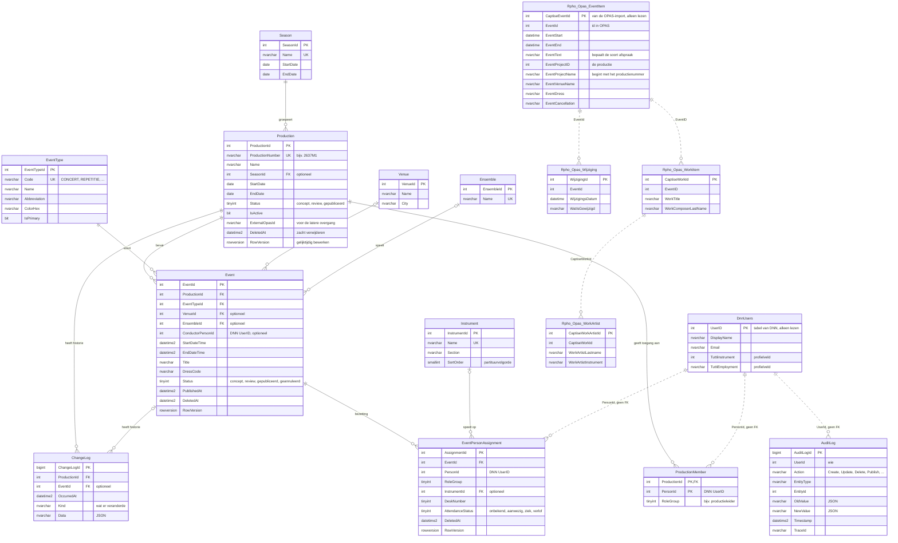

# Databaseontwerp - Tutti

*Ontwerp · Tutti · Metropole Orkest*

Dit document beschrijft de tabellen die Tutti gebruikt, hoe ze samenhangen en welke regels de database zelf bewaakt. Het gaat over versie 00.03.00.

| Gegeven | Waarde |
| --- | --- |
| Documenttype | Ontwerp (database) |
| Competentie | Design |
| Deelvraag | 3 - data- en autorisatiemodel |
| Auteur | Ardit Fazliji |
| Versie van Tutti | 00.03.00 |
| Datum | 1 oktober 2026 |
| Gerelateerd | [Architectuurontwerp](<Architectuurontwerp.md>) · [Backendontwerp](<Backendontwerp.md>) · [Gegevensstromen](<Gegevensstromen.md>) · [Technische SRS - Tutti](<../02. Analysis/Technische_SRS_Tutti.md>), hoofdstuk 5 en 6 |

## Inhoud

1. [Overzicht](#1-overzicht)
2. [De tabellen van Tutti](#2-de-tabellen-van-tutti)
3. [Personen zijn DNN-gebruikers](#3-personen-zijn-dnn-gebruikers)
4. [De OPAS-tabellen](#4-de-opas-tabellen)
5. [Regels die de database zelf bewaakt](#5-regels-die-de-database-zelf-bewaakt)
6. [Verwijderen en wijzigen](#6-verwijderen-en-wijzigen)
7. [Afwijkingen van de Technische SRS](#7-afwijkingen-van-de-technische-srs)

## 1. Overzicht

Tutti gebruikt de SQL Server-database van de DNN-site; er is geen aparte database. Daarin staan drie soorten tabellen:

| Tabellen | Van wie | Tutti mag |
| --- | --- | --- |
| `Tutti_*` | Tutti zelf | lezen en schrijven |
| `Users`, `UserPortals`, profielvelden | DNN | alleen lezen |
| `dbo.Rpho_Opas_*` | de OPAS-import | alleen lezen |

In het diagram is het voorvoegsel `Tutti_` weggelaten. Doorgetrokken lijnen zijn echte koppelingen (foreign keys); gestippelde lijnen zijn koppelingen zonder foreign key. `PK` is de sleutel, `FK` een verwijzing naar een andere tabel, `UK` een waarde die uniek moet zijn. Alle tijden in de tabellen van Tutti zijn UTC.

## 2. De tabellen van Tutti

| Tabel | Wat het is |
| --- | --- |
| `Season` | Een seizoen, bijvoorbeeld 2026-2027, met begin- en einddatum |
| `Production` | Een productie met een uniek productienummer (zoals 2637M1), naam, periode en status (concept, review, gepubliceerd) |
| `Event` | Een afspraak binnen precies één productie: soort, begin, einde, zaal, ensemble, dirigent, kledingvoorschrift, notities en status (ook geannuleerd) |
| `EventType` | De soorten afspraken (concert, repetitie, soundcheck, vervoer, opname, educatie) met kleur en afkorting |
| `Venue` | Een zaal of locatie |
| `Ensemble` | Een ensemble dat bij een afspraak speelt |
| `Instrument` | Een instrument, met de sectie en de volgorde in de partituur |
| `EventPersonAssignment` | De bezetting: wie bij een afspraak speelt, met rol, instrument, lessenaar en aanwezigheid (onbekend, aanwezig, ziek, verlof) |
| `ProductionMember` | Wie bij een productie hoort om die te mogen beheren of zien: productieleiders en remplaçanten |
| `ChangeLog` | De wijzigingshistorie die musici zien: wat er veranderde aan een gepubliceerde afspraak of productie |
| `AuditLog` | De audittrail: wie wat wanneer deed, met oude en nieuwe waarden. Kan niet worden gewijzigd of verwijderd |

`Season`, `EventType`, `Venue`, `Ensemble` en `Instrument` zijn vaste lijsten. Soorten afspraken, instrumenten en ensembles worden bij de installatie gevuld.

## 3. Personen zijn DNN-gebruikers

Er is geen personentabel. Een persoon in Tutti is een gebruiker van de DNN-site: elk `PersonId` en `ConductorPersonId` is een DNN-`UserID`. Naam en e-mail komen uit DNN; hoofdinstrument (`TuttiInstrument`) en dienstverband (`TuttiEmployment`: vast, remplaçant of extern) zijn profielvelden die in het gewone gebruikersbeheer van DNN worden ingevuld.

Die kolommen hebben bewust geen foreign key naar DNN: DNN kan gebruikers definitief verwijderen, en de bezetting van vorig seizoen moet dat overleven. Een naam die niet meer bestaat, wordt getoond als `#<id>`.

## 4. De OPAS-tabellen

De OPAS-import, een andere DNN-module, zet elk uur de export van OPAS in de tabellen `dbo.Rpho_Opas_*`. Tutti leest ze en schrijft er nooit in. Er zijn geen foreign keys; de koppelingen in het diagram zijn afspraken van de import.

| Tabel | Wat het is |
| --- | --- |
| `Rpho_Opas_EventItem` | Eén afspraak uit OPAS met alles erbij: tijden, tekst, zaal, dirigent, ensemble, kleding, productie (`EventProjectID`, de naam begint met het productienummer) en een veld voor geannuleerd |
| `Rpho_Opas_Wijziging` | Wat de import zag veranderen, als Nederlandse zin |
| `Rpho_Opas_WorkItem`, `Rpho_Opas_WorkArtist` | Het programma en de solisten (nu nog leeg: de export van het orkest vult ze niet) |

In het diagram staan alleen de kolommen die Tutti gebruikt. De volledige OPAS-tabellen staan in de documentatie van de broncode (`docs/opas.md` in de repository `Dnn.Modules.Tutti`).

## 5. Regels die de database zelf bewaakt

| Regel | Hoe |
| --- | --- |
| Een productienummer is uniek (onder niet-verwijderde producties) | Unieke index met filter `WHERE DeletedAt IS NULL` |
| Een persoon staat hoogstens één keer op een bezetting, en kan na verwijderen opnieuw worden toegevoegd | Unieke index op `(EventId, PersonId)` met hetzelfde filter |
| Een einde ligt nooit voor het begin | Check-constraints op `Event`, `Production` en `Season` |
| Een afspraak heeft altijd een titel | Check-constraint op `Title` |
| Een productie met afspraken kan niet worden verwijderd | De verwijderopdracht controleert dat; de foreign key blokkeert hard verwijderen |
| Externe sleutels (`ExternalOpasId`) zijn uniek waar ze gevuld zijn | Unieke index met filter `WHERE ... IS NOT NULL` |
| Twee mensen overschrijven elkaars werk niet ongemerkt | Kolom `RowVersion`, gecontroleerd bij elke `UPDATE` |
| De audittrail blijft onveranderd | Een trigger weigert elke `UPDATE` en `DELETE` op `AuditLog` |
| De agenda is snel | Indexen op `Event(StartDateTime, ProductionId)` en `EventPersonAssignment(PersonId, EventId)` |

## 6. Verwijderen en wijzigen

- **Zacht verwijderen.** `Production`, `Event` en `EventPersonAssignment` krijgen bij verwijderen een `DeletedAt`; de rij blijft bestaan voor de historie.
- **Elke wijziging drie keer vastgelegd**, in één transactie: de rij zelf, een regel in `AuditLog`, en een regel in `ChangeLog` als musici de afspraak al konden zien.
- **Versies.** De tabellen worden gemaakt en bijgewerkt door de scripts `00.01.00.SqlDataProvider` en `00.01.01.SqlDataProvider`. Een test vergelijkt de volledige ERD (`docs/data-model-erd.md` in de broncode) met de database die de scripts maken, zodat documentatie en database niet uit elkaar kunnen lopen.

## 7. Afwijkingen van de Technische SRS

De [Technische SRS - Tutti](<../02. Analysis/Technische_SRS_Tutti.md>) (hoofdstuk 5) schetst het doelmodel. Deze versie bouwt het deel dat niet van een open beslissing afhangt; de rest is bewust weggelaten in plaats van gegokt.

| Technische SRS | Gebouwd | Waarom |
| --- | --- | --- |
| `Document`, `SheetMusicPart` | Nog niet | Wacht op `TD-003` (rechten SharePoint-koppeling) en `TD-008` (waar de metadata staat) |
| Tabel `Person` met `ExternalAfasId`, `DnnUserId`, naam en e-mail | Geen tabel: een persoon is de DNN-gebruiker zelf | Iedereen heeft toch een DNN-account nodig (`AUTH-001`, `AUTH-003`); een tweede record van dezelfde persoon voegt alleen een koppeling toe die fout kan zijn of kan ontbreken. Instrument en dienstverband zijn profielvelden van DNN |
| - | `ProductionMember` | De productiescope uit `AUTH-007` heeft een plek nodig: welke productieleider of remplaçant bij welke productie hoort |
| - | `AuditLog` | Beschreven in SRS 11.1, maar niet opgenomen in de ERD van de SRS |
| `ChangeLog` hangt onder `Event` | Onder `Production`, met een optionele `Event` | "Productie gepubliceerd" en "afspraak vervallen" horen bij geen bestaande afspraak |
| `ChangeLog` als tekst | `Kind` + `Data` | Opgeslagen als gegevens, zodat de wijziging in het Nederlands of Engels gelezen kan worden |
| - | `Event.PublishedAt` | Een geannuleerde afspraak blijft alleen zichtbaar als musici die ooit konden zien |
| - | `NameEn`, `SectionEn` | Engelse namen van soorten afspraken en instrumenten |
| - | `EventType.SortOrder`, `Instrument.SortOrder` | Het belangrijkste afspraaktype op een productiekaart; de partituurvolgorde in een bezetting |

**Gevolgen voor de open beslissingen.** `Document` en `SheetMusicPart` later toevoegen raakt geen bestaande tabel: beide hangen via een foreign key onder `Production` en `Event`. Hetzelfde geldt voor de OPAS-sleutels, die al bestaan als `ExternalOpasId` (`MIG-001`) en leeg mogen blijven zolang de migratie loopt. De AFAS-sleutel van een persoon (`MIG-006`) is er nog niet; die wordt een profielveld naast instrument en dienstverband.
