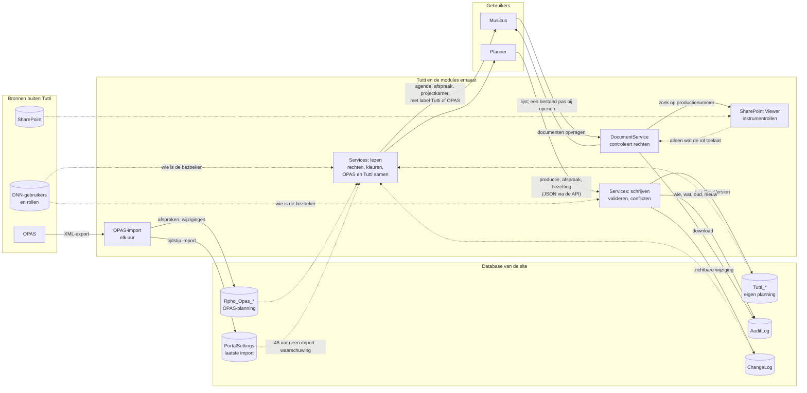
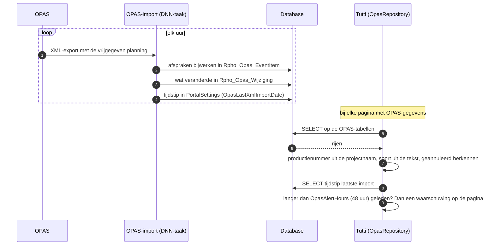
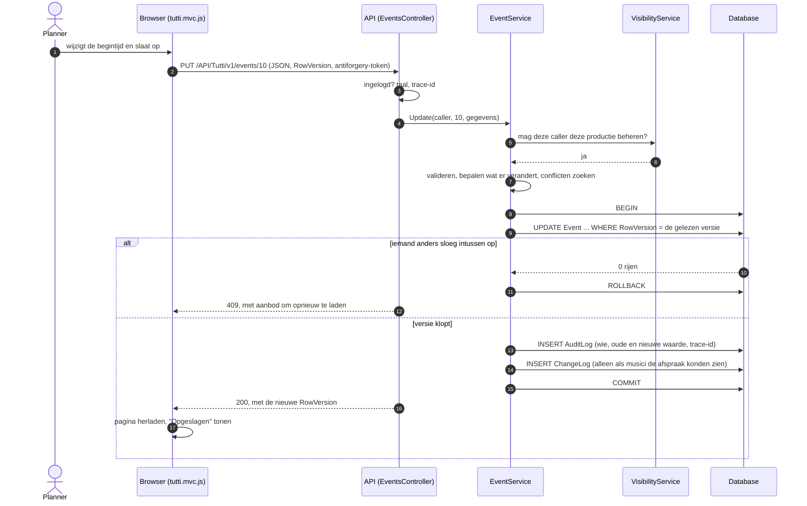
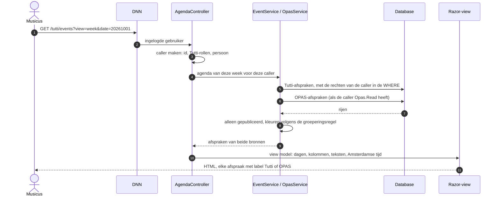
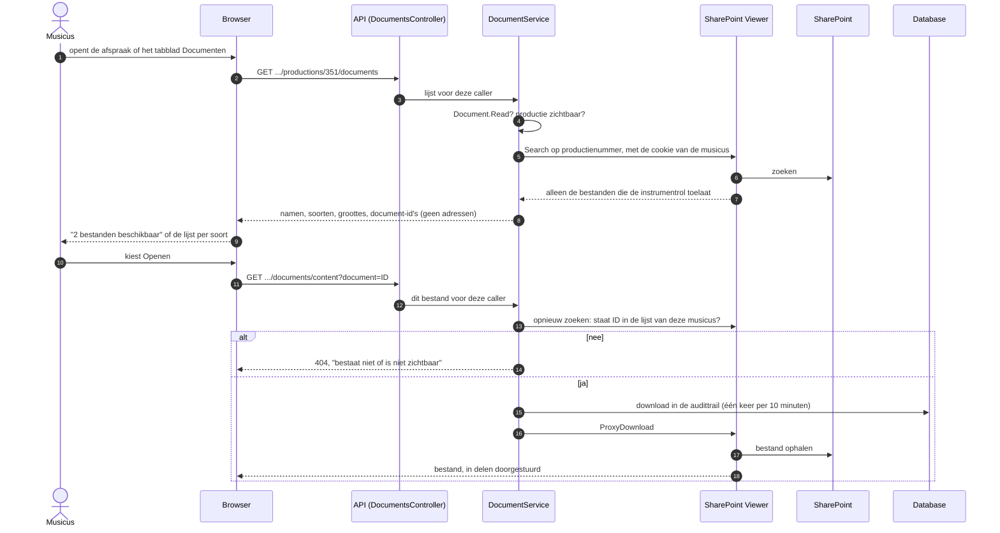

# Gegevensstromen - Tutti

*Ontwerp · Tutti · Metropole Orkest*

Dit document beschrijft welke gegevens waar vandaan komen, waar ze naartoe gaan en wie ze mag zien. Eerst het overzicht, daarna de vier stromen apart, elk stap voor stap.

| Gegeven | Waarde |
| --- | --- |
| Documenttype | Ontwerp (gegevensstromen) |
| Competentie | Design |
| Deelvraag | 2 - architectuur- en integratieaanpak; 3 - data- en autorisatiemodel |
| Auteur | Ardit Fazliji |
| Versie van Tutti | 00.03.00 |
| Datum | 1 oktober 2026 |
| Gerelateerd | [Architectuurontwerp](<Architectuurontwerp.md>) · [Databaseontwerp](<Databaseontwerp.md>) · [Backendontwerp](<Backendontwerp.md>) · [Technische SRS - Tutti](<../02. Analysis/Technische_SRS_Tutti.md>), hoofdstuk 2 en 8 |

## Inhoud

1. [Overzicht](#1-overzicht)
2. [De OPAS-planning komt binnen](#2-de-opas-planning-komt-binnen)
3. [Een planner wijzigt de planning](#3-een-planner-wijzigt-de-planning)
4. [Iemand bekijkt de planning](#4-iemand-bekijkt-de-planning)
5. [Documenten en bladmuziek](#5-documenten-en-bladmuziek)

## 1. Overzicht

Getrokken lijnen: gegevens die worden geschreven of verstuurd. Gestippelde lijnen: gegevens die alleen worden gelezen.

## 2. De OPAS-planning komt binnen

OPAS is het planningssysteem van het orkest en blijft leidend. Tutti kopieert niets: het leest bij elke pagina de tabellen die de OPAS-import vult.

- Alleen wat in OPAS is **vrijgegeven**, komt in de export en dus in Tutti.
- Wie bij welke OPAS-afspraak speelt, slaat de import niet op. Daarom hebben OPAS-afspraken in Tutti geen bezetting.
- Zijn de OPAS-tabellen niet te lezen, dan toont Tutti de eigen planning met een melding welk deel ontbreekt.
- De waarschuwing na 48 uur zonder import volgt eis `AVL-008` uit de Technische SRS.

## 3. Een planner wijzigt de planning

Alles wat in Tutti wordt ingevoerd, gaat via de API. Een wijziging, de audittrail en de wijzigingshistorie worden in één transactie opgeslagen: alle drie of geen.

- Tijden worden in de browser omgezet van Amsterdamse tijd naar UTC; de database rekent in UTC.
- Een conflict (dezelfde persoon of zaal tegelijk elders) is een waarschuwing, geen weigering.
- Wijzigingen aan een concept komen wel in de audittrail, niet in de wijzigingshistorie: niemand buiten de planning kende de afspraak nog.

## 4. Iemand bekijkt de planning

Een pagina is een gewone link. De server haalt de gegevens op met de rechten van de bezoeker en stuurt een complete pagina terug.

- Wat de bezoeker niet mag zien, wordt niet opgehaald: de rechten staan in de query zelf.
- Weergave, datum en filters staan in het webadres, zodat herladen en delen dezelfde weergave geven.

## 5. Documenten en bladmuziek

De bestanden blijven in SharePoint. Tutti vraagt de lijst pas op als de pagina er al is, en een bestand gaat pas over de lijn als iemand het opent. Er zijn twee sloten: Tutti controleert de rechten op de productie, de SharePoint Viewer de instrumentrollen.

- Er gaan geen wachtwoorden, tokens of SharePoint-adressen naar de browser.
- Een document-id uit een andere bron opent niets: het moet voorkomen in wat de viewer op dat moment voor deze bezoeker laat zien.
- PDF, afbeeldingen, audio, video en tekst openen in een nieuw tabblad; al het andere wordt een download.
- Het vastleggen van downloads volgt eis `SEC-015` uit de Technische SRS.
